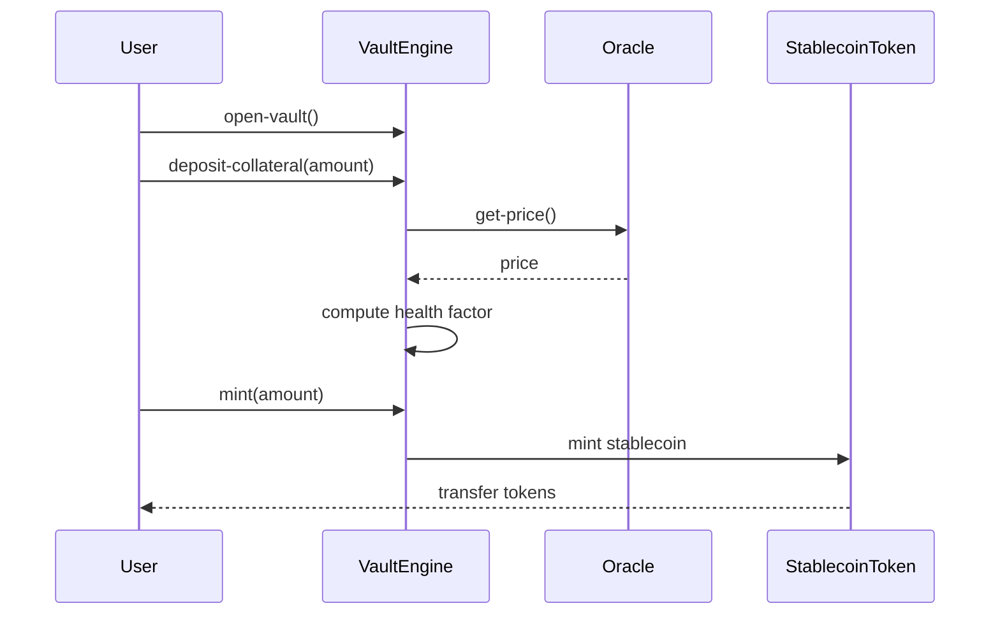
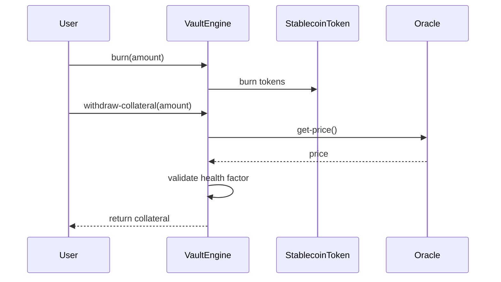
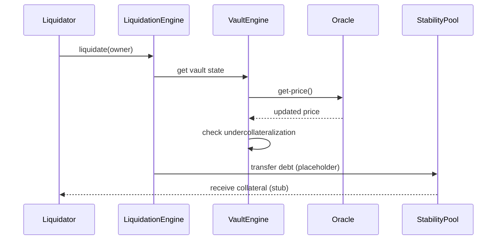
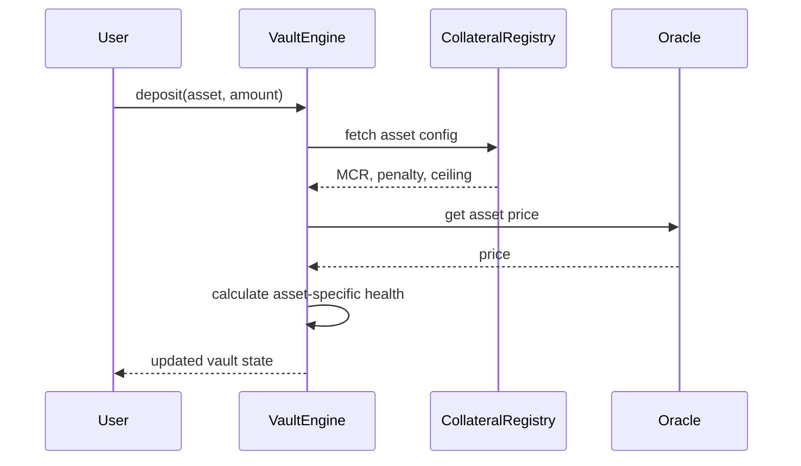
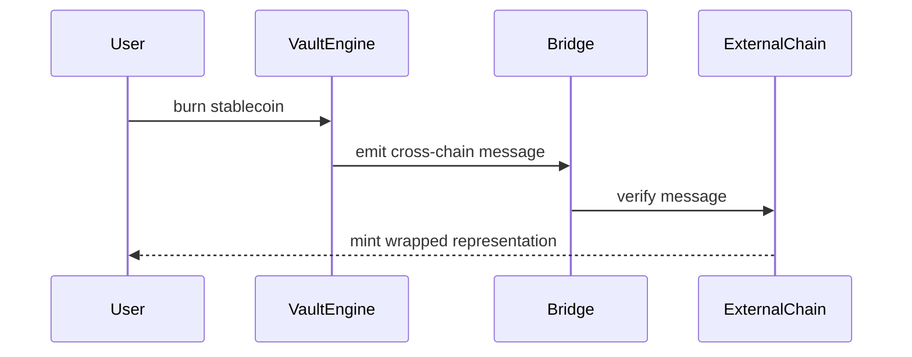
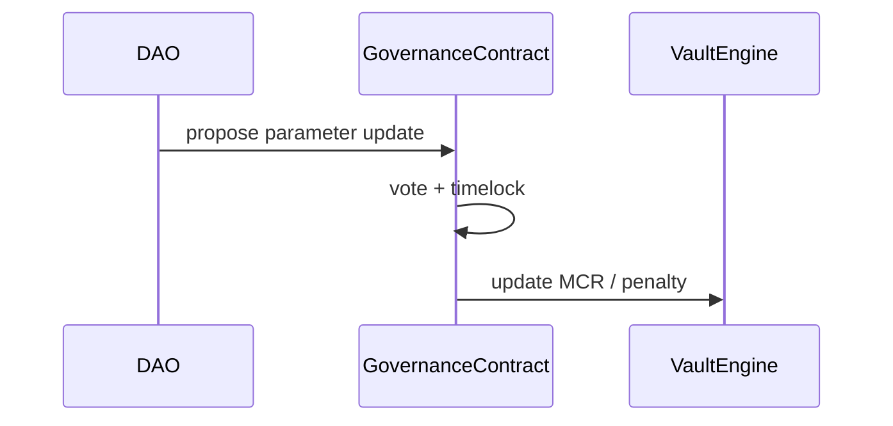

# Stacks Stablecoin Engine (SSE)

**Live app:** https://app.stablecoin-engine.com/vaults

## Documentation Map

| Doc | Purpose |
|---|---|
| [`docs/getting_started.md`](./docs/getting_started.md) | Combined user + technical reference (personas, sequence diagrams, full function reference) |
| [`docs/SSE_CONTEXT.md`](./docs/SSE_CONTEXT.md) | Product intent and consistency rules |
| [`docs/roadmap.md`](./docs/roadmap.md) | Feature coverage status and roadmap (contract vs frontend) |
| [`docs/adl/user_flows.md`](./docs/adl/user_flows.md) | Long-form user-flow specifications |
| [`docs/adl/crosschain.md`](./docs/adl/crosschain.md) | Cross-chain bridge design notes |
| [`AGENTS.md`](./AGENTS.md) | Repository rules for coding agents |
| [`sse.config.json`](./sse.config.json) | Source of truth for deployed contract names |

## Project Overview
Stacks Stablecoin Engine (SSE) is a modular infrastructure layer for launching and operating Bitcoin-backed, overcollateralized stablecoins on Stacks using sBTC and STX as collateral. Creators register stablecoins through a factory, configure per-stablecoin risk parameters, and users open vaults and mint against them. A reference Next.js frontend is deployed at https://app.stablecoin-engine.com.

## Problem Statement
Developers who want to explore sBTC-backed CDP systems on Stacks need a clean, modular starting point. SSE provides that foundation with minimal logic, clear interfaces, and TODO markers for production-grade risk and liquidation systems.

## Grant Scope
This project is scoped to an 8–12 week grant timeline and focuses on core infrastructure:
- No governance
- No tokenomics
- No emissions model
- No AI components
- No advanced liquidation auctions (simple proportional reward model)

A reference frontend is included (not part of the protocol surface) at `frontend/` and deployed at https://app.stablecoin-engine.com.

## Architecture Overview
High-level flow (simplified current state):

```
User → VaultEngine → StablecoinToken
              ↓
        CollateralRegistry
              ↓
            Oracle
```

## Contract Breakdown

### Core Contracts (deployed versions)
- `stablecoin-factory-v3.clar`: **Stablecoin registration factory** with configurable STX fees and treasury address.
- `stablecoin-token-v4.clar`: SIP-010 token using native `define-fungible-token` with mint/burn restricted to vault engines and cross-chain bridge hooks. Enables proper Stacks post-condition enforcement.
- `sbtc-token-v4.clar` / `stx-token-v4.clar`: Collateral tokens using native `define-fungible-token` for post-condition support.
- `collateral-registry-v5.clar`: Extended registry for collateral configurations including min ratio, liquidation ratio, liquidation penalty, stability fee, debt ceiling/floor, enabled status, per-asset oracles, and per-stablecoin overrides.
- `multi-asset-vault-engine-v6.clar`: **Multi-asset CDP engine** supporting multiple collateral types per vault with per-asset positions, health factors, debt tracking, and real SIP-010 custody transfers.
- `stability-pool-v5.clar`: Stablecoin-scoped deposit/withdraw with product-based accounting and reward-per-token for liquidation collateral distribution.
- `liquidation-engine-v6.clar`: Full liquidation orchestrator (health check → vault-engine seize → pool distribute).

### Oracle Contracts
- `oracle-trait.clar`: Trait defining `get-price`.
- `dia-oracle-adapter.clar`: Forwards to the real DIA oracle on testnet/mainnet (`ST1S5ZGRZV5K4S9205RWPRTX9RGS9JV40KQMR4G1J.dia-oracle`).
- `price-oracle-dia-btc-v2.clar` / `price-oracle-dia-stx-v2.clar`: `oracle-trait` implementations wrapping DIA with staleness guard and ms→s timestamp conversion.
- `sip-010-trait.clar`: Local SIP-010 trait definition used by the token.

### Cross-Chain Bridge Contracts
- `bridge-adapter-trait.clar`: Trait defining the interface for cross-chain bridge adapters (`mint-from-remote`, `burn-to-remote`).
- `xreserve-adapter.clar`: Adapter implementing the bridge trait for Circle's xReserve protocol (USDCx-style bridging).
- `bridge-registry.clar`: Registry mapping tokens to their bridge adapters and remote chain configurations.

## Multi-Asset Collateral System

SSE supports multiple collateral types with asset-specific risk parameters.

### Adding a Collateral Type
```clarity
;; Add a new collateral type with full configuration
(contract-call? .collateral-registry add-collateral-type
  'ST1PQHQKV0RJXZFY1DGX8MNSNYVE3VGZJSRTPGZGM.sbtc-token  ;; Asset principal
  u150        ;; min-collateral-ratio: 150%
  u120        ;; liquidation-ratio: 120%
  u10         ;; liquidation-penalty: 10%
  u200        ;; stability-fee: 2% (200 basis points)
  u10000000   ;; debt-ceiling: 10M max debt
  u100        ;; debt-floor: 100 minimum debt per position
  'ST1PQHQKV0RJXZFY1DGX8MNSNYVE3VGZJSRTPGZGM.price-oracle-mock  ;; Oracle
)
```

### Multi-Asset Vault Operations
```clarity
;; Open a vault
(contract-call? .multi-asset-vault-engine open-vault)

;; Deposit multiple collateral types
(contract-call? .multi-asset-vault-engine deposit-collateral 
  'ST...sbtc-token u1000)
(contract-call? .multi-asset-vault-engine deposit-collateral 
  'ST...stx-token u5000)

;; Mint against specific collateral
(contract-call? .multi-asset-vault-engine mint-against-asset 
  'ST...sbtc-token u500)

;; Repay debt against specific collateral
(contract-call? .multi-asset-vault-engine repay-against-asset 
  'ST...sbtc-token u200)

;; Withdraw collateral (health factor permitting)
(contract-call? .multi-asset-vault-engine withdraw-collateral 
  'ST...sbtc-token u300)
```

### Collateral Registry Parameters

| Parameter | Description |
|-----------|-------------|
| `min-collateral-ratio` | Minimum ratio required to mint (e.g., 150 = 150%) |
| `liquidation-ratio` | Ratio at which liquidation can occur (e.g., 120 = 120%) |
| `liquidation-penalty` | Penalty applied during liquidation (e.g., 10 = 10%) |
| `stability-fee` | Annual fee in basis points (e.g., 200 = 2%) |
| `debt-ceiling` | Maximum total debt for this collateral type |
| `debt-floor` | Minimum debt per position (dust limit) |
| `enabled` | Whether this collateral type is active |
| `oracle` | Price oracle contract for this asset |

Note: This is a prototype. The multi-asset vault engine tracks per-asset positions and health factors independently.

## Stablecoin Registration Factory

SSE includes a factory contract for registering new stablecoins with configurable fees.

### Features
- **Configurable registration fee** paid in STX
- **Configurable treasury address** for fee collection
- **Fee can be set to 0** to disable (for testnet/experimental deployments)
- **Unique name/symbol enforcement** prevents duplicates
- **Creator tracking** for per-user stablecoin enumeration

### Registering a Stablecoin
```clarity
;; Register a new stablecoin (pays fee to treasury)
(contract-call? .stablecoin-factory register-stablecoin
  "My Stablecoin"   ;; Name (max 32 chars)
  "MUSD"            ;; Symbol (max 10 chars)
)
;; Returns: (ok stablecoin-id)

;; Link deployed token contract to registration
(contract-call? .stablecoin-factory set-token-contract
  u0                                              ;; stablecoin-id
  'ST1PQHQKV0RJXZFY1DGX8MNSNYVE3VGZJSRTPGZGM.my-token
)
```

### Admin Configuration
```clarity
;; Set registration fee (only owner)
;; Default: 10 STX (10,000,000 microSTX)
(contract-call? .stablecoin-factory set-registration-fee u5000000)  ;; 5 STX

;; Disable fee (set to 0)
(contract-call? .stablecoin-factory set-registration-fee u0)

;; Set treasury address (only owner)
(contract-call? .stablecoin-factory set-treasury-address 'ST...treasury)
```

### Read-Only Functions
```clarity
;; Get current fee
(contract-call? .stablecoin-factory get-registration-fee)

;; Get treasury address
(contract-call? .stablecoin-factory get-treasury-address)

;; Lookup stablecoin by name or symbol
(contract-call? .stablecoin-factory get-stablecoin-by-name "My Stablecoin")
(contract-call? .stablecoin-factory get-stablecoin-by-symbol "MUSD")

;; Check if name/symbol is taken
(contract-call? .stablecoin-factory is-name-taken "My Stablecoin")
(contract-call? .stablecoin-factory is-symbol-taken "MUSD")
```

## Installation Instructions
1. Install Clarinet (Homebrew):
   ```bash
   brew install clarinet
   ```
2. Install JS dependencies:
   ```bash
   npm install
   ```

## How to Run Tests
```bash
npm test
```

## How to Deploy
Deployment is config-driven via `sse.config.json`. A single command deploys all contracts and runs the bootstrap in sequence:

```bash
npm run deploy
```

This reads from `sse.config.json` to determine which contracts to deploy and which bootstrap steps to run (authorizations, oracle mappings, collateral types, oracle principal updates).

Configure your deployer mnemonic/key in `settings/Testnet.toml` before running.

## Testnet Deployment (v6 — current)
Deployer: `ST3DGG4B53XA12A6NQTXWK4346YPTC3B2B0ATA6HF`

Deployed 2026-05-08.

### Contracts on-chain:

| Contract | Version | Notes |
|---|---|---|
| `stablecoin-factory` | v3 | Unchanged from v3 |
| `stablecoin-token` | v4 | Native `define-fungible-token` for post-condition support |
| `sbtc-token` | v4 | Native `define-fungible-token` for post-condition support |
| `stx-token` | v4 | Native `define-fungible-token` for post-condition support |
| `collateral-registry` | v5 | Updated refs to vault-engine-v6 |
| `multi-asset-vault-engine` | v6 | Updated refs to token-v4, registry-v5, pool-v5, liquidation-v6 |
| `stability-pool` | v5 | Updated refs to liquidation-engine-v6 |
| `liquidation-engine` | v6 | Full orchestration with vault-engine-v6 reference |
| `dia-oracle-adapter` | — | Forwards to `ST1S5ZGRZV5K4S9205RWPRTX9RGS9JV40KQMR4G1J.dia-oracle` |
| `price-oracle-dia-btc` | v2 | DIA-backed BTC price with staleness guard |
| `price-oracle-dia-stx` | v2 | DIA-backed STX price with staleness guard |

### Bootstrap steps (run automatically by `npm run deploy`):
- Authorizing `multi-asset-vault-engine-v6` in `stablecoin-token-v4`
- Authorizing `multi-asset-vault-engine-v6` in `collateral-registry-v5`
- Registering DIA oracle ID mappings (sBTC → oracle 3, STX → oracle 4) in `multi-asset-vault-engine-v6`
- Adding collateral types (sBTC + STX) with DIA oracle contracts in `collateral-registry-v5`
- Updating oracle principals in `collateral-registry-v5` to point to v2 DIA oracles

## How to Test on Testnet

### 1) Vault lifecycle smoke test
Use a testnet wallet account and call in this order:

1. `open-vault`
2. `deposit-collateral u1200`
3. `mint u600`
4. `burn u200`
5. `withdraw-collateral u300`

Then verify:
- `get-health-factor '<YOUR_TESTNET_PRINCIPAL>` is at least `u150`
- `stablecoin-token::get-balance '<YOUR_TESTNET_PRINCIPAL>` returns the expected remaining balance
- `stablecoin-token::get-total-supply` tracks aggregate mint/burn changes

### 2) Oracle sensitivity check
On testnet, prices come from DIA oracles (`price-oracle-dia-btc-v2`, `price-oracle-dia-stx-v2`). To test health factor changes, observe the live DIA price feed and check:

1. Re-check `multi-asset-vault-engine-v6::get-health-factor-for-stablecoin '<YOUR_TESTNET_PRINCIPAL> <STABLECOIN_ID>`.
2. If health factor is below the liquidation ratio, call `liquidation-engine-v6::liquidate`.

Expected behavior:
- Healthy vault: `liquidate` returns `(err u300)`
- Undercollateralized vault: `liquidate` orchestrates collateral seizure and pool accounting

### 3) Collateral registry config check
As deployer:

```clarity
(contract-call? .collateral-registry-v5 add-collateral-type
  'ST3DGG4B53XA12A6NQTXWK4346YPTC3B2B0ATA6HF.sbtc-token-v4
  u150
  u120
  u10
  u200
  u1000000
  u100
  'ST3DGG4B53XA12A6NQTXWK4346YPTC3B2B0ATA6HF.price-oracle-dia-btc-v2
)

(contract-call? .collateral-registry-v5 get-collateral-config
  'ST3DGG4B53XA12A6NQTXWK4346YPTC3B2B0ATA6HF.sbtc-token-v4
)
```

## Example Usage Flow (Multi-Asset)

```clarity
;; 1. Register a stablecoin (pays STX fee)
(contract-call? .stablecoin-factory-v3 register-stablecoin "MyUSD" "mUSD")
;; -> (ok u0)   ; stablecoin-id

;; 2. After deploying & linking a token contract, configure collateral
(contract-call? .collateral-registry-v5 configure-collateral-for-stablecoin
  u0                                                            ;; stablecoin-id
  'ST3DGG4B53XA12A6NQTXWK4346YPTC3B2B0ATA6HF.sbtc-token-v4      ;; asset
  u150 u120 u10 u200 u1000000 u100)                             ;; min-cr / liq-ratio / penalty / fee / ceiling / floor

;; 3. Open vault and deposit
(contract-call? .multi-asset-vault-engine-v6 open-vault-for-stablecoin u0)
(contract-call? .multi-asset-vault-engine-v6 deposit-collateral-for-stablecoin
  u0 'ST3DGG4B53XA12A6NQTXWK4346YPTC3B2B0ATA6HF.sbtc-token-v4
  .sbtc-token-v4 u1000000)

;; 4. Mint against the position (validates health factor)
(contract-call? .multi-asset-vault-engine-v6 mint-against-asset-for-stablecoin
  u0 'ST3DGG4B53XA12A6NQTXWK4346YPTC3B2B0ATA6HF.sbtc-token-v4
  .<your-linked-token> u500)

;; 5. Repay and withdraw
(contract-call? .multi-asset-vault-engine-v6 repay-against-asset-for-stablecoin
  u0 'ST3DGG4B53XA12A6NQTXWK4346YPTC3B2B0ATA6HF.sbtc-token-v4
  .<your-linked-token> u200)
(contract-call? .multi-asset-vault-engine-v6 withdraw-collateral-for-stablecoin
  u0 'ST3DGG4B53XA12A6NQTXWK4346YPTC3B2B0ATA6HF.sbtc-token-v4
  .sbtc-token-v4 u300)
```

See [`docs/getting_started.md`](./docs/getting_started.md) for complete sequence diagrams and function reference.


## User Flows (Grant Scope)

### Open Vault & Mint Stable Coin




### Repay & Withdraw Collateral



### Basic Liquidation Flow (Stub Logic)



> Note: Liquidation math and redistribution logic are intentionally simplified in Phase 1


## User Flows (Out of Scope for Current Grant)

### Multi-Asset & Advanced Risk Model



### Cross-Chain Mint/Burn Architecture



### Governance & Parameter Updates



## Cross-Chain Bridge Infrastructure

SSE includes bridge-ready infrastructure so stablecoins created through the protocol can move cross-chain (Ethereum ↔ Stacks) using a USDCx/xReserve-style pattern.

### Architecture

```
┌─────────────────────────────────────────────────────────────────┐
│                        Ethereum / EVM                           │
│  ┌──────────────┐        ┌─────────────────────────────────┐    │
│  │   USDC/ERC20 │───────▶│  xReserve (depositToRemote)     │    │
│  └──────────────┘        └─────────────────────────────────┘    │
└────────────────────────────────┬────────────────────────────────┘
                                 │ Attestation Service
┌────────────────────────────────▼────────────────────────────────┐
│                           Stacks                                │
│  ┌─────────────────────┐    ┌─────────────────────────────────┐ │
│  │ bridge-adapter-trait│◀───│ xreserve-adapter                │ │
│  └─────────────────────┘    └───────────┬─────────────────────┘ │
│                                         │                       │
│  ┌──────────────────────────────────────▼─────────────────────┐ │
│  │ stablecoin-token (with bridge hooks)                       │ │
│  │  • mint-from-bridge (adapter-only)                         │ │
│  │  • burn-to-remote (user-callable via adapter)              │ │
│  └────────────────────────────────────────────────────────────┘ │
│                                                                 │
│  ┌────────────────────────────────────────────────────────────┐ │
│  │ bridge-registry                                            │ │
│  │  • token → remote-chain-id, remote-address, adapter        │ │
│  └────────────────────────────────────────────────────────────┘ │
└─────────────────────────────────────────────────────────────────┘
```

### Bridge Setup (Post-Deployment)

1. **Set the bridge adapter on the token:**
```clarity
(contract-call? .stablecoin-token set-bridge-adapter
  '<DEPLOYER>.xreserve-adapter
)
```

2. **Configure the adapter:**
```clarity
;; Set the attestation service (authorized to mint)
(contract-call? .xreserve-adapter set-attestation-service '<ATTESTATION_SERVICE_PRINCIPAL>)

;; Set the bridged token
(contract-call? .xreserve-adapter set-bridged-token '<DEPLOYER>.stablecoin-token)

;; Add supported chains
(contract-call? .xreserve-adapter add-supported-chain u1 "Ethereum Mainnet")
(contract-call? .xreserve-adapter add-supported-chain u11155111 "Ethereum Sepolia")
```

3. **Register token in bridge registry:**
```clarity
(contract-call? .bridge-registry add-chain u1 "Ethereum Mainnet")
(contract-call? .bridge-registry register-token
  '<DEPLOYER>.stablecoin-token
  '<DEPLOYER>.xreserve-adapter
)
```

### Cross-Chain Flow

**Deposit (Ethereum → Stacks):**
1. User approves xReserve on Ethereum to spend USDC
2. User calls `depositToRemote` with encoded Stacks recipient
3. Attestation service picks up the event
4. Attestation service calls `mint-from-remote` on xreserve-adapter
5. Adapter calls `mint-from-bridge` on stablecoin-token
6. User receives tokens on Stacks

**Withdrawal (Stacks → Ethereum):**
1. User calls `burn-to-remote` on xreserve-adapter with encoded EVM recipient
2. Adapter calls `burn-to-remote` on stablecoin-token
3. Token emits burn event with remote recipient data
4. Attestation service picks up the event
5. xReserve releases USDC to user on Ethereum

### TypeScript SDK Helpers

The `scripts/bridge/` directory contains helpers for cross-chain operations:

```typescript
import {
  encodeStacksAddressToBytes32,
  encodeEvmAddressToBytes32,
  depositToStacks,
  withdrawToEvm,
} from './scripts/bridge';

// Encode addresses for cross-chain calls
const stacksBytes32 = encodeStacksAddressToBytes32('ST1PQHQKV0RJXZFY1DGX8MNSNYVE3VGZJSRTPGZGM');
const evmBytes32 = encodeEvmAddressToBytes32('0x742d35Cc6634C0532925a3b844Bc9e7595f5bE21');
```

## Future Roadmap (Out of Scope for Current Grant)
- Multi-asset collateral
- Non-xReserve bridge providers (LayerZero, Wormhole)
- Governance and parameter updates
- Advanced liquidation auctions
- Frontend UI for bridging


## Disclaimer
This repository is a prototype infrastructure template only. It is not production-ready and should not be used to secure real value. Use at your own risk.

## License
Source-available under the [PolyForm Noncommercial License 1.0.0](./LICENSE).

- **Permitted:** personal use, research, education, non-profit use, hobby projects, and contributions back to this repository.
- **Not permitted without a separate commercial license:** offering the software (or a derivative) as a paid product or hosted service, using it inside a for-profit product, or any other commercial purpose.

For commercial licensing, contact the maintainer at yehiatarek67@gmail.com.
