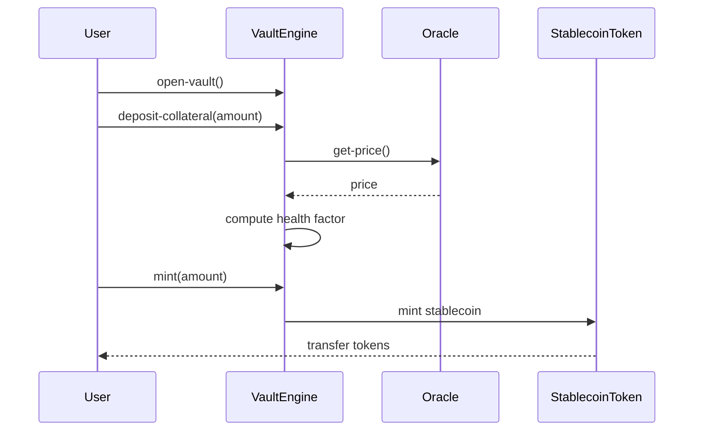
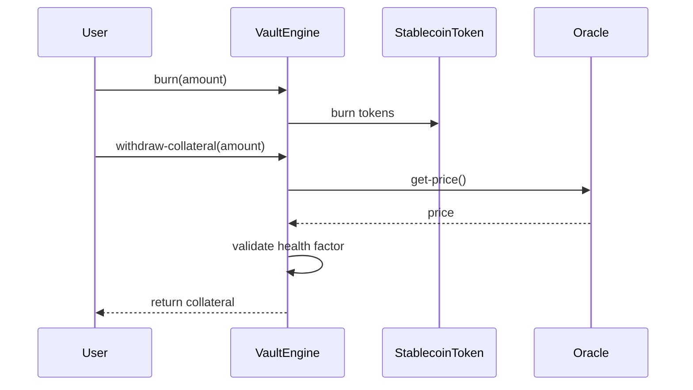
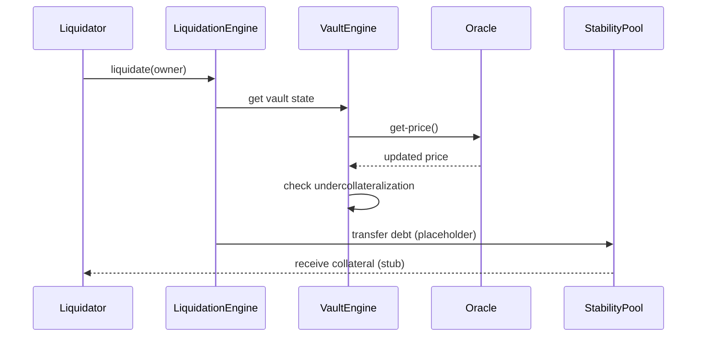
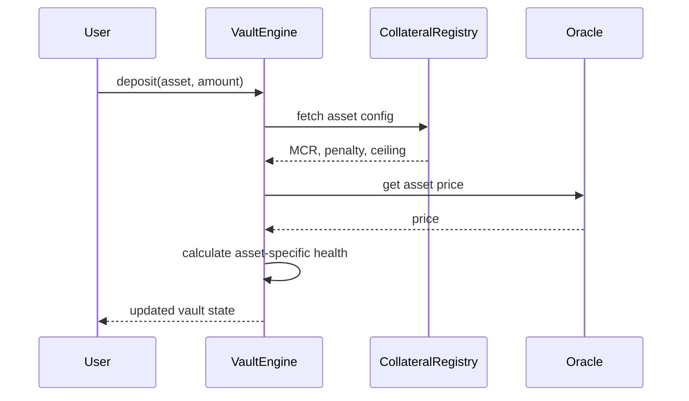
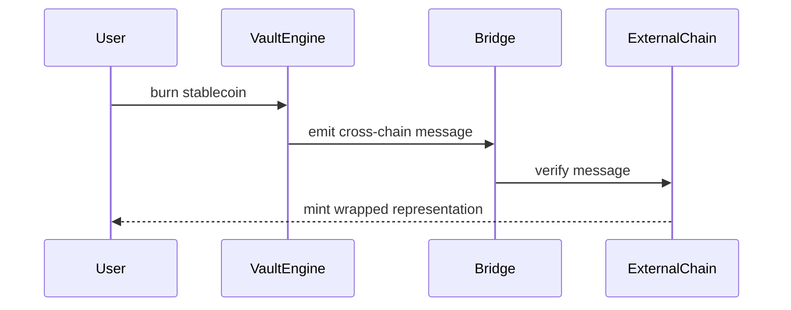
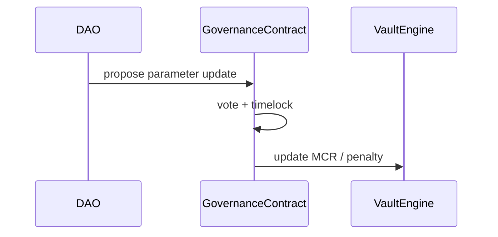

# Stacks Stablecoin Engine (SSE)

## Project Overview
Stacks Stablecoin Engine (SSE) is a minimal, reusable infrastructure template for experimenting with Bitcoin-backed, overcollateralized stablecoins on Stacks using sBTC. This is an early-stage prototype intended for a grant submission and rapid developer experimentation.

## Problem Statement
Developers who want to explore sBTC-backed CDP systems on Stacks need a clean, modular starting point. SSE provides that foundation with minimal logic, clear interfaces, and TODO markers for production-grade risk and liquidation systems.

## Grant Scope (Prototype Infrastructure Only)
This project is intentionally scoped to an 8–12 week grant timeline and focuses on infrastructure only:
- No governance
- No tokenomics
- No emissions model
- No frontend
- No cross-chain bridging logic
- No AI components
- No advanced liquidation math

## Architecture Overview
High-level flow (simplified current state):

```
User → VaultEngine → StablecoinToken
              ↓
        CollateralRegistry
              ↓
            Oracle
```

## Contract Breakdown
- `vault-engine.clar`: Core CDP logic. Tracks vaults, collateral, and debt. Includes minimal health checks and TODOs for production math and sBTC transfers.
- `collateral-registry.clar`: Registry for collateral configurations (min ratio, liquidation penalty, debt ceiling).
- `stablecoin-token.clar`: Minimal SIP-010 token with mint/burn restricted to `vault-engine`.
- `liquidation-engine.clar`: Stub liquidation entry point with placeholder health checks.
- `stability-pool.clar`: Simple deposit/withdraw tracking with TODO for liquidation redistribution.
- `oracle-trait.clar`: Trait defining `get-price`.
- `price-oracle-mock.clar`: Mock oracle returning a constant price for testing.
- `sip-010-trait.clar`: Local SIP-010 trait definition used by the token.

## Collateral Registry Example Config
```clarity
;; Add one collateral config (example values only)
(contract-call? .collateral-registry add-collateral-type
  'ST1PQHQKV0RJXZFY1DGX8MNSNYVE3VGZJSRTPGZGM.stablecoin-token
  u150
  u10
  u1000000
)

;; Read back the stored config
(contract-call? .collateral-registry get-collateral-config
  'ST1PQHQKV0RJXZFY1DGX8MNSNYVE3VGZJSRTPGZGM.stablecoin-token
)
```

Note: this is a prototype example. Registry values are available for integration, but not all modules enforce every parameter yet.

## Installation Instructions
1. Install Clarinet (Homebrew):
   ```bash
   brew install clarinet
   ```
2. Install JS dependencies:
   ```bash
   npm install
   ```

## How to Run Tests
```bash
npm test
```

## How to Deploy
This project uses Clarinet deployment plans.

1. Configure your deployer in `settings/Testnet.toml`.
2. Generate a deployment plan:
   ```bash
   clarinet deployments generate --testnet
   ```
3. Apply the deployment plan:
   ```bash
   clarinet deployments apply --testnet
   ```

## Example Usage Flow
1. `open-vault`
2. `deposit-collateral`
3. `mint`
4. `burn`
5. `withdraw-collateral`

Note: Current collateral transfers and liquidation logic are placeholders with TODOs for production-grade behavior.


## User Flows (Grant Scope)

### Open Vault & Mint Stable Coin




### Repay & Withdraw Collateral



### Basic Liquidation Flow (Stub Logic)



> Note: Liquidation math and redistribution logic are intentionally simplified in Phase 1


## User Flows (Out of Scope for Current Grant)

### Multi-Asset & Advanced Risk Model



### Cross-Chain Mint/Burn Architecture



### Governance & Parameter Updates



## Future Roadmap (Out of Scope for Current Grant)
- Multi-asset collateral
- Cross-chain integrations
- Governance and parameter updates
- Advanced liquidation auctions


## Disclaimer
This repository is a prototype infrastructure template only. It is not production-ready and should not be used to secure real value. Use at your own risk.
