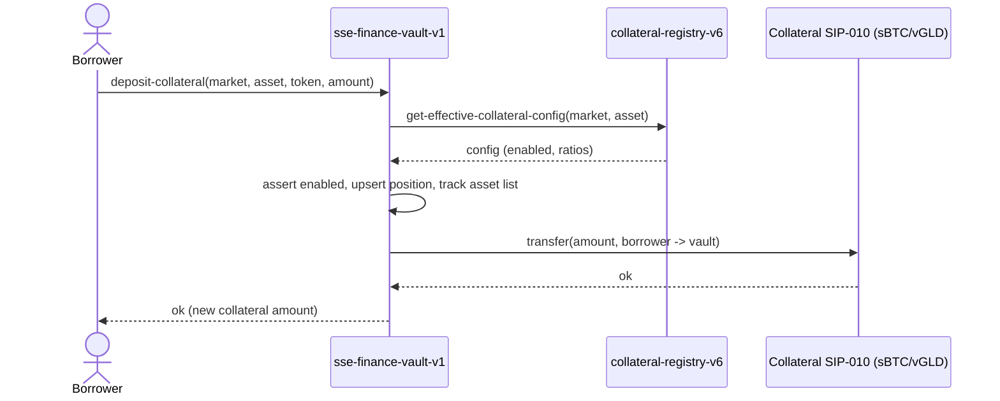
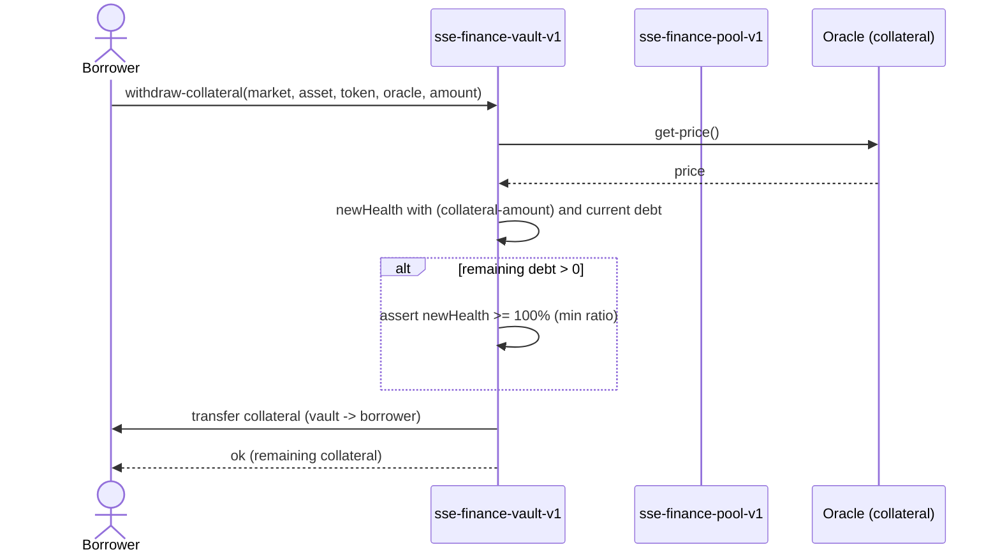

# SSE Finance — Architecture & Planning

**Status:** Design / planning phase (no implementation yet)
**Scope:** A collateralized financing marketplace that lets users unlock liquidity from
productive assets by **borrowing existing stablecoins (USDC, USDA, …)** against collateral —
*without* issuing a new protocol stablecoin.
**Author basis:** analysis of the live SSE codebase (vault engine v8, collateral registry v6,
stability pool v7, liquidation engine v8, governance/timelock v1).

---

## 0. The one decision that shapes everything

The existing **SSE Stablecoin Engine is a mint-based CDP**: a borrower locks collateral and the
engine **mints a brand-new protocol stablecoin** (`stablecoin-token-v4.mint`) as debt. Repayment
**burns** it.

**SSE Finance is an interest-free, peer-to-pool lending market (Liquity-style):** a borrower locks
collateral and **borrows pre-existing third-party stablecoins** that *liquidity providers supplied*.
No minting, no burning — debt is **real USDC/USDA moved out of a pool**. **The borrower pays no
recurring interest**; debt stays flat at principal, and the borrower keeps all collateral yield. The
**lender's (LP's) only return is the liquidation discount**: when a position is liquidated, the pool
repays the debt and seizes collateral worth ~110–120% of it, so the surplus (the discount/penalty) is
the LP's profit. **Protocol revenue** comes from non-interest **fees** (a one-time borrow fee + a cut
of the liquidation penalty — see §3.5), never from interest.

That change (mint → transfer-from-pool, and interest-free) cascades into every deliverable:

| Concern | Stablecoin Engine (today) | SSE Finance (new) |
|---|---|---|
| Source of borrowed funds | Minted on demand (infinite) | **Finite LP pool** (USDC/USDA) |
| Debt settlement | `mint` / `burn` | `transfer` out / `transfer` in |
| Debt over time | n/a | **Flat — no interest accrual** (principal only) |
| Borrower cost | Stability fee | **One-time borrow fee only** (no recurring cost) |
| Lender economics | Protocol captures stability fee | **LPs earn the liquidation discount** (lumpy) |
| Collateral yield | n/a | **Borrower keeps 100%** (never redirected to LPs) |
| Liquidity risk | None (mint can't run dry) | **Real** — utilization, bank-run, withdrawal caps |
| Liquidation backstop | Stability pool burns the protocol coin | Pool **writes off a USDC loan**, seizes collateral |

Everything else — vault state shape, health-factor math, multi-collateral accounting, oracle
dispatch, the LP `product`/reward-per-token engine, governance/timelock — **can be reused almost
verbatim**. SSE Finance is best framed as *"the existing engine, with the mint replaced by a funded
pool — and no interest, so the debt is just flat principal."*

> **Open economic decision (LP incentive):** with no interest, LPs earn *only* when liquidations
> happen — zero in calm periods. To bootstrap LP deposits, optionally route a slice of the one-time
> borrow fee to LPs (baseline return). Flagged again in §3.5. Pure liquidation-only is also valid.

---

## 1. Architecture Report

### 1.1 What already exists and how much we keep

| Existing component | Role today | SSE Finance disposition |
|---|---|---|
| `multi-asset-vault-engine-v8` | Multi-collateral vaults, health-factor math, deposit/withdraw/mint/repay/liquidate | **Reuse the pattern, fork the contract.** Keep vault state shape, `calculate-position-health-factor`, oracle validation, multi-asset list. Replace `mint`/`burn` with pool `borrow`/`repay`. |
| `collateral-registry-v6` | Per-asset risk params (min-ratio, liq-ratio, penalty, ceiling, floor, oracle), governance-gated, debt tracking | **Reuse directly for collateral side.** Already deployment-free for new collateral. Add a sibling registry for *borrowable-stablecoin markets*. |
| `stability-pool-v7` | Liquity-style LP pool: `product`/snapshot loss accounting + `cumulative-reward-per-token` collateral distribution | **Reuse the math wholesale.** This is ~90% of the SSE Finance pool (no interest index needed). Add only: (a) `borrow`/`repay` transfer paths, (b) utilization-gated withdrawals. |
| `liquidation-engine-v8` | Reads health, computes debt-offset & collateral-to-seize, settles vault + notifies pool | **Reuse the pattern, fork.** Swap "burn protocol coin from pool" for "write off USDC loan + move collateral to LP claims." |
| `oracle-trait` + `price-oracle-*` (dia-btc, vgld, egpb) | `get-price → (response uint uint)`, registry holds oracle principal per asset | **Reuse directly.** Add a USDC/USDA price source (constant ≈ $1 *or* a real depeg-aware feed — see Risk §5). |
| `sse-governance-v1` | Registry of admin (Asigna multisig) / guardian / timelock | **Reuse directly.** SSE Finance contracts point their governance var at the same timelock. |
| `sse-timelock-v1` | Compound-style queue/execute/cancel, emergency whitelist, enumerated targets | **Reuse pattern; needs a v2.** Targets/functions are hardcoded enums (`TARGET-VAULT`, `FN-COLL-ADD`, …). Adding SSE Finance admin surface requires new target/fn constants → `sse-finance-timelock` or a generalized `(target, fn-id, args)` dispatcher. |
| Frontend `/api/stacks/[...path]` proxy | Multi-RPC failover + short-TTL read cache | **Reuse directly.** No change. |
| Frontend libs (`stacks.ts`, `oracles.ts`, `walletProvider.ts`, `useContract*`) | Wallet, oracle price fetch, contract read/write hooks | **Reuse directly.** Add market/pool hooks. |
| Frontend pages `pool/`, `liquidations/`, `governance/`, `vaults/` | Existing UI surfaces | **Reuse as templates** for the SSE Finance equivalents. |

### 1.2 New smart contracts required

1. **`sse-finance-vault-v1`** — borrower-facing. Deposit/withdraw collateral, open position, borrow
   from pool, repay to pool. Health checks identical to engine v8. **Does not mint**; calls the pool.
2. **`sse-finance-pool-v1`** — LP-facing + protocol funds custodian. Supply/withdraw stablecoin,
   share accounting, serves borrows, absorbs liquidations, distributes seized collateral to LPs.
   Builds on `stability-pool-v7` math. **No interest index** — debt is flat principal.
3. **`sse-finance-market-registry-v1`** — admin-facing. Registry of **borrowable stablecoin markets**
   (which token, oracle, borrow cap, paused flag) + the **fee config** (one-time borrow fee,
   liquidation-penalty split) and the market↔collateral risk matrix. (Collateral *asset* params can
   stay in `collateral-registry-v6`.)
4. **`sse-finance-liquidation-v1`** — health check → pool-funded write-off → collateral seizure →
   LP distribution. Mechanism per §`Liquidation Design`.
5. **`sse-finance-timelock` (or timelock-v2)** — extends the enumerated-target timelock to cover the
   new admin surfaces, or generalizes dispatch.

*(No interest-rate-model contract — the protocol is interest-free. Borrowing is gated by collateral
ratio and borrow caps, not by a price-of-money rate.)*

### 1.3 Required backend services

SSE Finance is designed to **minimize off-chain infrastructure** (core principle: no keepers, no
bots). Interest accrues **lazily on-chain** (index updated on every interaction), so there is no
required accrual cron.

| Service | Required? | Purpose |
|---|---|---|
| **Health monitor / liquidation submitter** | Recommended, not protocol-critical | Watches positions vs oracle price; submits `liquidate`. Liquidation is *permissionless to trigger* — anyone (including LPs and the team) can call it — so this is a convenience, not a trust dependency. A small fixed trigger-reward keeps it incentive-compatible without a specialized bot network. |
| **Analytics / indexer** | Recommended | Reads `print` events (pool-supply, borrow, repay, liquidation-distributed) into Supabase for dashboards (utilization, APY, TVL, LP claims). Mirrors existing event-reading patterns. |
| **Oracle relay** | Reuse existing | Same DIA/oracle plumbing already feeding the engine. |
| **RPC proxy** | Reuse existing | `/api/stacks` failover + cache. |

### 1.4 Required frontend changes

New routes (mirroring existing `vaults/`, `pool/`, `liquidations/`):

- `app/finance/markets` — list borrowable markets (USDC, USDA): supply APY, borrow APY, utilization, caps.
- `app/finance/borrow/[market]` — borrower flow: pick collateral, deposit, borrow, repay, withdraw, live health factor.
- `app/finance/supply/[market]` — LP flow: supply, withdraw (with available-liquidity cap shown), claim collateral rewards, view accrued interest.
- `app/finance/liquidations` — at-risk positions + claimable seized collateral for LPs.
- Admin: extend existing `governance/` UI with SSE Finance market/registry actions (all timelock-routed).

Reused as-is: wallet connect, oracle price fetch, the `/api/stacks` proxy, governance queue/execute UI.

---

## 2. Data Model

Naming uses Clarity map conventions. `stablecoin-id` from the engine is generalized to
**`market-id`** (a borrowable-stablecoin market).

### 2.1 Markets (`sse-finance-market-registry-v1`)

```
markets: { market-id: uint } -> {
  borrow-token:      principal,   ;; SIP-010 of the borrowable stablecoin (USDC/USDA)
  oracle:            principal,   ;; price source for the borrow token (depeg-aware)
  borrow-cap:        uint,        ;; max total borrows for this market
  enabled:           bool,
  paused:            bool         ;; emergency stop (borrow disabled, repay/withdraw allowed)
}

market-count: uint
market-list: { index: uint } -> { market-id: uint }
```

#### Flexible fees (protocol revenue) — `sse-finance-market-registry-v1`

Fees live in a **dedicated, independently updatable map** (not inline in `markets`) so revenue
parameters can be tuned per market via the timelock without touching market wiring. Every fee is
**bps, per-market, bounded by a hard `MAX-*` constant** (so even a compromised governance can't set
a 100% rug fee), and all collected fees route to a single **treasury** recipient.

```
fee-config: { market-id: uint } -> {
  borrow-fee-bps:          uint,  ;; ONE-TIME fee on borrow principal (charged at draw) — main revenue
  borrow-fee-lp-share-bps: uint,  ;; OPTIONAL: % of the borrow fee paid to LPs (rest to protocol)
  protocol-liq-share-bps:  uint,  ;; protocol's cut of the liquidation PENALTY (LPs get the rest)
  ;; optional / default 0:
  early-repay-fee-bps:     uint   ;; only if fixed-term products are added (Phase 2/3)
}

;; Accrued protocol revenue awaiting sweep to treasury, per market & token.
treasury-accrued: { market-id: uint, token: principal } -> { amount: uint }

;; Global revenue knobs (governance/timelock-gated)
treasury: principal              ;; recipient of swept fees (SSE treasury / Asigna)
fee-config-default: { ... }      ;; sensible defaults applied to new markets at creation
```

**Hard caps (constants, not settable):**
`MAX-BORROW-FEE-BPS = u200` (2%), `MAX-BORROW-FEE-LP-SHARE-BPS = u10000` (100% of the fee),
`MAX-PROTOCOL-LIQ-SHARE-BPS = u5000` (50% of penalty), `MAX-EARLY-REPAY-FEE-BPS = u200`.
Setters `asserts!` against these; values can move freely *below* the cap.
**No interest-based reserve factor** — the protocol is interest-free, so there is no interest to skim;
all protocol revenue is the one-time borrow fee + the liquidation-penalty cut.

**Recorded launch decision — `borrow-fee-lp-share-bps = u0` (pure liquidation-only).** The LP
baseline-incentive dial launches at **0**: the whole one-time borrow fee accrues to the protocol and
LPs earn solely from the liquidation discount. This is implemented as the contract constant
`LAUNCH-BORROW-FEE-LP-SHARE-BPS` in `sse-finance-market-registry-v1` (documentation only — the value
actually stored per market is whatever `register-market` is called with at onboarding). The dial
remains governance-settable up to `MAX-BORROW-FEE-LP-SHARE-BPS` via `set-fee-config`, so a baseline LP
return can be switched on later without a redeploy.

The **collateral↔market matrix** (which collateral is allowed for which market, and at what ratio)
reuses the existing per-stablecoin override mechanism in `collateral-registry-v6`
(`stablecoin-collateral-configs` keyed by `{stablecoin-id, asset}` → here `{market-id, asset}`).

### 2.2 Liquidity pools (`sse-finance-pool-v1`)

```
;; Aggregate market state (no interest index — debt is flat principal)
pool-state: { market-id: uint } -> {
  total-supplied:   uint,   ;; principal supplied by LPs (cash + borrowed)
  total-borrows:    uint,   ;; principal currently lent out (flat, no interest)
  cash:             uint    ;; idle balance available for borrows / withdrawals
}

;; LP share accounting (reuses stability-pool product/snapshot — no supply index)
lp-shares:    { lp: principal, market-id: uint } -> { shares: uint }

;; Liquidation loss + collateral reward (REUSED verbatim from stability-pool-v7)
pool-product:               { market-id: uint } -> { product: uint }
user-product-snapshot:      { lp: principal, market-id: uint } -> { product: uint }
cumulative-reward-per-token:{ market-id: uint, asset: principal } -> { reward-per-token: uint }
user-reward-snapshot:       { lp: principal, market-id: uint, asset: principal } -> { reward-per-token: uint }
pending-collateral-rewards: { lp: principal, market-id: uint, asset: principal } -> { amount: uint }
```

### 2.3 Vaults & Positions (`sse-finance-vault-v1`)

Same shape as engine v8, `stablecoin-id` → `market-id`:

```
vaults: { owner: principal, market-id: uint } -> {
  borrow-principal:  uint,   ;; debt = flat principal (no interest, never grows on its own)
  created-at:        uint
}

vault-collateral: { owner: principal, market-id: uint, asset: principal } -> {
  amount:      uint,
  debt-share:  uint          ;; per-collateral debt attribution (multi-collateral health), as in v8
}

vault-asset-count: { owner, market-id } -> { count: uint }
vault-asset-list:  { owner, market-id, index: uint } -> { asset: principal }
```

### 2.4 Debt records

Debt is a **flat principal** — no interest, no index, no time component:

```
debt_owed(owner, market) = borrow-principal     ;; constant until borrow/repay/liquidate
```

The one-time borrow fee is taken at draw (added to debt *or* netted from the disbursed amount — see
§3.5), not accrued over time. Global per-collateral debt + ceilings reuse `collateral-registry-v6`'s
`increase-stablecoin-debt` / `decrease-stablecoin-debt`.

### 2.5 Liquidation records

```
liquidations: { id: uint } -> {
  owner:            principal,
  market-id:        uint,
  asset:            principal,
  debt-written-off: uint,    ;; USDC principal removed from total-borrows
  collateral-seized: uint,
  penalty-bps:      uint,
  block:            uint
}
liquidation-count: uint
```

Seized collateral is **not** held in a separate "reserve" map in Mechanism A — it is distributed
immediately to LP claims via `cumulative-reward-per-token` (see §Liquidation). A reserve map is only
needed if Mechanism B (auction) is chosen.

---

## 3. Smart Contract Design (responsibilities)

### 3.1 `sse-finance-vault-v1` (vault contract)
- Own all borrower position state (collateral + flat debt principal).
- Enforce health factor on `borrow` and `withdraw` using `collateral-registry-v6` ratios + oracle
  trait validation (identical to engine v8 `price-asset-via`).
- On `borrow`: check health & borrow cap & debt floor, apply the one-time borrow fee, instruct pool to
  **transfer** borrow-token to the user. No interest, no index.
- On `repay`: owed = flat principal (no accrual); pull borrow-token from user **to pool**, reduce
  principal.
- Custody collateral; expose `liquidate-position` callable **only** by `sse-finance-liquidation-v1`
  (mirrors v8's `contract-caller` gate).
- **Yield neutrality:** collateral is held 1:1; for non-rebasing collateral (sBTC, vGLD) no yield
  accrues to the contract. For coupon-bearing collateral (bonds, Phase 2) add a per-asset
  `coupon-claim` pass-through so the **borrower** claims collateral yield — never the pool. (Risk §5)

### 3.2 `sse-finance-pool-v1` (pool contract)
- Custody all supplied stablecoin (the cash that funds borrows).
- **No interest accrual** — there is no rate, no index. The pool just tracks `cash` and
  `total-borrows`.
- LP `supply` / `withdraw`: mint/burn shares; **withdraw capped at `cash`** (available liquidity) —
  the bank-run guard.
- `borrow-out` / `repay-in`: gated to the vault contract; move cash and update `total-borrows`.
  `borrow-out` also splits the one-time borrow fee (protocol vs optional LP share).
- Liquidation hooks (reused from stability-pool-v7): `distribute-liquidation-reward` updates
  `pool-product` (LP loss) and `cumulative-reward-per-token` (collateral gain); `claim-collateral-reward`.
  **This is the LPs' primary yield.**
- Read-only: utilization, available liquidity, LP balance & claimable collateral.

### 3.3 Governance responsibilities (`sse-governance-v1` + timelock)
- All market creation, **fee config (borrow fee + LP share, liquidation share), treasury recipient,**
  borrow caps, collateral ratios, liquidation thresholds, oracle sources, and **pause** routed through
  the **timelock** (Asigna multisig proposes/executes; guardian can cancel). Fee setters are
  additionally bounded by hard `MAX-*` caps (§2.1).
- **Pause** should be on the emergency fast-path whitelist (no delay) so a market can be frozen
  instantly in a depeg/oracle incident; **un-pause and parameter loosening go through full delay**.
- Treasury fee sweep / withdrawal: timelock-gated destination (the `treasury` principal).

### 3.4 Oracle requirements
- Reuse `oracle-trait` (`get-price`) and the registry's per-asset oracle principal + on-call
  validation (`is-eq (contract-of oracle) registered`).
- **Borrow-token oracle is new and important:** unlike the mint model where the protocol *defines*
  $1, here debt is real USDC/USDA. A depeg changes real solvency, so the borrow side needs a
  **depeg-aware price** (or a guarded constant with a circuit-breaker). See Risk §5.2.
- **One reusable USD-pegged oracle for all stablecoins.** Implement a single
  `price-oracle-pegged-usd-v1` (governance-settable ≈ $1 + staleness/deviation guard) that **every**
  USD stablecoin market reuses — so onboarding USDC, USDA, USDCX, … needs **no new oracle contract**.
  A token can later attach its own live feed via the registry's `update-oracle` (timelock, no redeploy).
- **Standard stablecoin onboarding (deployment-free):** any SIP-010 stablecoin becomes borrowable
  through one repeatable governance flow against the market registry — `register-market(token, oracle,
  cap, fee-config)` + set its depeg band + enable its collateral matrix rows. The token principal is
  config, never code; markets are isolated per stablecoin. (Tasks 2a/2b/3.)
- Collateral oracles (sBTC, vGLD) reuse existing feeds unchanged.

### 3.5 Fee model (protocol revenue) — *flexible, per-market, governance-tuned*

Because the protocol is **interest-free**, there is no interest to tax — so revenue comes from
**two non-interest fee streams** (plus an optional one for fixed-term products later). Each is a
per-market bps value bounded by a hard cap (§2.1); collected protocol fees accrue to
`treasury-accrued` then sweep to the `treasury` principal.

| Fee | Charged when | Base | Split | Default | Cap |
|---|---|---|---|---|---|
| **Borrow fee** (one-time) | At `borrow` (draw) | Borrowed principal | Protocol, *optionally* sharing `borrow-fee-lp-share-bps` with LPs | 0.5% | 2% |
| **Liquidation share** | At liquidation | Liquidation **penalty** only | Protocol gets `protocol-liq-share-bps`; **LPs get the rest** | 20% of penalty | 50% of penalty |
| **Early-repay** (opt) | Repay on fixed-term products | Principal | 100% protocol | 0% | 2% |

**Design rules**
- **Two ways to charge the borrow fee** — pick per product:
  *(a)* **added to debt** (borrow 1000, owe 1005), or *(b)* **netted from disbursed** (borrow 1000,
  receive 995, owe 1000). (a) is the Liquity convention; (b) is simpler to reason about. Default (a).
- **LP incentive knob.** With no interest, LPs earn only from liquidations (lumpy). Set
  `borrow-fee-lp-share-bps > 0` to route part of every borrow fee to LPs as a baseline return that
  doesn't depend on liquidations. 0 = pure liquidation-only model (also valid). **This is the key
  economic dial — decide before launch.**
- **Liquidation fee comes from the penalty, not from LP loss.** The penalty is the bonus collateral
  seized above debt; protocol takes a configurable slice, the rest still rewards LPs for
  backstopping. Capped at 50% so LPs keep a meaningful incentive.
- **Accrual is lazy, sweep is explicit.** Fees increment `treasury-accrued` during normal
  interactions (no keeper). A permissionless `sweep-fees(market, token)` moves the balance to
  `treasury` — anyone can trigger; funds can only ever land at the governance-set treasury.
- **Everything is timelock-gated and capped.** `set-fee-config` and `set-treasury` route through the
  timelock; values move freely *below* the hard `MAX-*` constants but can never exceed them —
  governance power is bounded by design.

**New admin surface (timelock targets):** `set-fee-config(market, …)`, `set-treasury(principal)`.

---

## 4. Sequence Diagrams

### 4.1 Deposit collateral



### 4.2 Borrow stablecoin

```mermaid
sequenceDiagram
    actor B as Borrower
    participant V as sse-finance-vault-v1
    participant P as sse-finance-pool-v1
    participant CR as collateral-registry-v6
    participant O as Oracle (collateral)
    B->>V: borrow(market, asset, oracle, amount)
    V->>CR: get-oracle(asset) + ratios
    V->>O: get-price()
    O-->>V: price
    V->>V: health = collateralValue / (debt+amount)·minRatio ; assert healthy
    V->>P: borrow-out(market, amount, borrower)   %% gated to vault
    P->>P: fee = amount * borrow-fee-bps ; split protocol vs LP-share ; treasury-accrued += protocolPart
    P->>P: assert amount <= cash ; total-borrows += amount ; cash -= (amount - fee)
    P->>B: transfer USDC net of borrow fee (pool -> borrower)
    V->>CR: increase-stablecoin-debt(market, asset, amount)
    V->>V: borrow-principal += amount   %% flat debt, no interest
    V-->>B: ok (debt, health-factor)
```

### 4.3 Repay debt

```mermaid
sequenceDiagram
    actor B as Borrower
    participant V as sse-finance-vault-v1
    participant P as sse-finance-pool-v1
    B->>V: repay(market, asset, amount)
    V->>V: owed = flat borrow-principal (no interest)
    V->>P: repay-in(market, amount, borrower)
    P->>B: transferFrom USDC (borrower -> pool)
    P->>P: total-borrows -= amount ; cash += amount
    V->>V: reduce borrow-principal
    V-->>B: ok (remaining debt)
```

### 4.4 Withdraw collateral



### 4.5 Liquidation flow (Mechanism A — pro-rata to LPs)

```mermaid
sequenceDiagram
    actor K as Anyone / Health monitor
    participant L as sse-finance-liquidation-v1
    participant V as sse-finance-vault-v1
    participant P as sse-finance-pool-v1
    participant O as Oracle (collateral)
    K->>L: liquidate(owner, market, asset, token, oracle)
    L->>O: get-price()
    O-->>L: price
    L->>V: get health-factor(owner, market, asset, price)
    V-->>L: health
    L->>L: assert health < liquidation threshold
    L->>L: debtToOffset = min(vaultDebt, poolCash+absorbable)
    L->>L: collateralToSeize = base + penalty bonus
    L->>V: liquidate-position(... debtToOffset, collateralToSeize)
    V->>V: reduce borrower debt & collateral
    V->>P: move seized collateral (vault -> pool)
    L->>P: distribute-liquidation-reward(market, asset, debtToOffset, collateralToSeize)
    P->>P: penalty = seized - debtEquivCollateral
    P->>P: protocolCut = penalty * protocol-liq-share-bps ; treasury-accrued += protocolCut
    P->>P: pool-product *= (supplied - loss)/supplied   %% LP loss share
    P->>P: cumulative-reward-per-token += (seized - protocolCut)/supplied %% LP collateral claim
    L-->>K: ok (debt-offset, collateral-seized, trigger-reward)
    Note over P: LPs later call claim-collateral-reward to pull discounted collateral
```

---

## 5. Risk Analysis

### 5.1 Oracle failures
- **Reuse** the registry's strict oracle binding (`contract-of` must equal registered principal;
  any mismatch/error → price `u0` → operations refuse). A failed/zero price makes borrow & withdraw
  fail closed (safe) but also **blocks liquidation** (unsafe — bad debt can't be cleared).
- *Mitigations:* per-asset **staleness/heartbeat check** in the oracle wrapper; a governance
  **circuit-breaker pause** (emergency fast-path) that freezes a market when the oracle is degraded;
  consider a fallback oracle principal per asset (timelock-swappable, already supported via
  `update-oracle`).

### 5.2 Stablecoin depeg (borrow side) — *new risk vs the mint model*
- If the borrowed stablecoin depegs **down**, LPs hold a depreciating asset and borrowers are
  incentivized to *not* repay. If it depegs **up**, borrowers are squeezed.
- *Mitigations:* depeg-aware borrow-token oracle + a **depeg circuit-breaker** that pauses new
  borrows (repay/withdraw still allowed) when |price−$1| exceeds a band; per-market **isolation**
  (USDC depeg must not poison the USDA market — separate `market-id` pools).

### 5.3 Liquidity shortage / high utilization
- Borrows draw down `cash`; at 100% utilization LPs cannot withdraw.
- *Note — interest-free means no rate lever.* There is no rising borrow rate to pull repayments in or
  push borrows out, so liquidity is managed purely by **borrow caps** + **collateral requirements**.
- *Mitigations:* **withdraw capped at `cash`** (enforced on-chain); conservative **borrow caps** per
  market; surface available-liquidity and utilization prominently in the LP UI; the LP collateral-
  discount upside is the standing incentive to supply.

### 5.4 Bank-run scenario
- Mass LP withdrawal when utilization is already high → first-movers exit, late LPs are locked into
  illiquid claims (their capital is lent out, not idle).
- *Mitigations:* the `cash` cap makes runs *orderly* (you can only withdraw idle cash); borrow caps
  bound how much can ever be locked up; optional **withdrawal cooldown / queue** for very large LPs
  (Phase 3, only if needed — avoid complexity now).

### 5.5 Collateral volatility
- sBTC is volatile; a fast drop can outrun liquidation and create bad debt (seized collateral worth
  less than written-off debt).
- *Mitigations:* conservative min-ratio / liquidation-ratio gap per the registry (already
  per-asset); liquidation **penalty bonus** rewards prompt liquidation; partial liquidation (offset
  = `min(vaultDebt, poolCapacity)`, already in v8) caps single-event LP loss; **LP loss
  socialization** (`pool-product`) absorbs residual bad debt transparently. Accrued protocol fees in
  the treasury can optionally be directed to cover bad debt before socializing it to LPs.

### 5.6 Governance risks
- A compromised admin could add a malicious oracle, drop ratios, or drain reserves.
- *Mitigations:* **reuse the existing timelock** — Asigna multisig + guardian cancel + 24h default
  delay + MIN-DELAY floor (can't be shrunk below ~1h). Only **pause** is no-delay; everything that
  *loosens* risk goes through full delay. Treasury destination timelock-gated. Per-market isolation
  caps blast radius.

---

## 6. Roadmap

### Phase 1 — Core lending (sBTC + vGLD collateral, USDC borrowing)
- Contracts: `sse-finance-vault-v1`, `sse-finance-pool-v1` (interest-free, flat debt),
  `sse-finance-market-registry-v1`, `sse-finance-liquidation-v1` (**Mechanism A**, pro-rata).
- Reuse: collateral-registry-v6, oracle-trait + existing sBTC/vGLD feeds, governance/timelock.
- New: USDC market + depeg-aware oracle. **No interest engine.**
- **Revenue from day one:** one-time borrow fee (0.5%) + liquidation share (20% of penalty).
  Decide the `borrow-fee-lp-share` (LP baseline incentive) before launch. `sweep-fees` → treasury.
- Frontend: `finance/markets`, `finance/borrow`, `finance/supply`, `finance/liquidations`.
- Backend: event indexer for analytics; optional health-monitor submitter (permissionless trigger).

### Phase 2 — Tokenized bonds & treasury collateral
- Add bond/treasury assets via `collateral-registry` (deployment-free) + their oracles.
- **Collateral-yield pass-through**: coupon-claim path so borrowers keep bond yield (requirement).
- Add **USDA** borrowing market (isolated pool).
- Consider per-asset risk tiers and stricter caps for less-liquid collateral.

### Phase 3 — Institutional pools & advanced collateral
- **Institutional / permissioned LP pools** (KYC-gated supply via the existing institutional layer).
- **Mechanism B (LP-restricted auction)** for large/illiquid collateral where pro-rata in-kind
  distribution is inefficient — opt-in per market.
- Cross-collateral portfolios, **optional fixed-term loans** (where an explicit term fee could apply),
  and treasury-grade reporting. *(Still interest-free in the spot market — any term pricing is an
  explicit one-time fee, not accruing interest.)*

---

## Appendix A — Liquidation mechanism comparison

The protocol intentionally has **no public liquidator network**; LPs are the backstop. Three ways to
give LPs the seized collateral:

| | **A. Pro-rata in-kind** | **B. LP-restricted auction** | **C. Claim-based rights** |
|---|---|---|---|
| How | Seized collateral auto-distributed to all LPs by share (`reward-per-token`) | LPs bid USDC for seized collateral; proceeds refill pool | LPs get a *right* to buy seized collateral at a discount, proportional to deposit; must actively claim+pay |
| Reuses existing code | **Yes — this is exactly `stability-pool-v7`** | Partially (needs new auction module) | Partially (needs claim/settlement module) |
| Keeper/bot needed | **No** | Effectively yes (bidders, timing) | No, but needs active LP participation |
| Capital efficiency | Medium (LPs hold collateral risk in-kind) | **High** (collateral sold near market) | Medium-High |
| Complexity | **Low** | High | Medium |
| Transparency | **High** (deterministic) | Medium (auction dynamics) | Medium |
| Best for | Liquid collateral (sBTC, vGLD) | Illiquid/large (bonds, treasuries) | Mixed |

**Recommendation:** Ship **A** in Phase 1 — it is already implemented and battle-tested in
`stability-pool-v7`, needs no keeper, and is maximally transparent. Introduce **B as an opt-in
per-market mode in Phase 3** specifically for illiquid collateral where in-kind pro-rata leaves LPs
holding hard-to-exit assets. Treat **C** as unnecessary middle-ground unless a concrete need appears.
Do not assume one fits all markets — make the mechanism a per-market setting.

---

## Appendix B — Reuse summary (build vs borrow)

- **Borrow (reuse) ~80%:** health-factor math, multi-collateral vault state, oracle dispatch +
  validation, LP `product`/reward-per-token engine, collateral registry, governance, timelock,
  RPC proxy, wallet/oracle frontend libs.
- **Build (new) ~20%:** mint→pool-transfer borrow/repay paths (flat debt, **no interest**),
  cash/withdrawal-cap accounting, borrowable-market registry, **per-market fee layer (one-time borrow
  fee + liquidation share) + treasury sweep**, depeg-aware borrow oracle + breaker, finance-specific
  frontend routes, and timelock-v2 targets.

Because the protocol is **interest-free**, the hardest part of a typical lending market — the
interest-rate model and index accounting — **does not exist here**. The decisive new engineering is
just the **funded-pool plumbing** (cash, withdrawal caps, borrow/repay transfers) and the **fee
layer**, layered on SSE's existing, proven CDP + Liquity-style stability-pool foundation. The LP
return is the liquidation discount, exactly as the stability pool already distributes it.
```
