# SSE Platform - UI/UX Design Document

## Table of Contents
1. [User Personas](#user-personas)
2. [Platform Overview](#platform-overview)
3. [Navigation Structure](#navigation-structure)
4. [User Flows by Persona](#user-flows-by-persona)
5. [Screen Specifications](#screen-specifications)
6. [Component Library](#component-library)

---

## User Personas

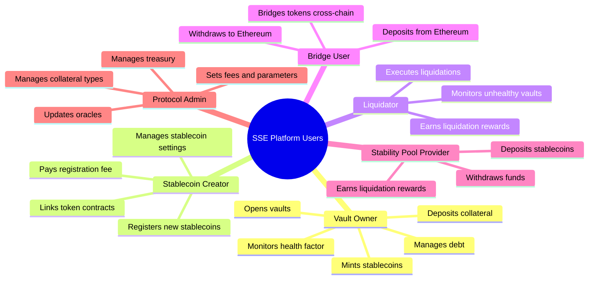
```mermaid
mindmap
  root((SSE Platform Users))
    Vault Owner
      Opens vaults
      Deposits collateral
      Mints stablecoins
      Manages debt
      Monitors health factor
    Stablecoin Creator
      Registers new stablecoins
      Pays registration fee
      Links token contracts
      Manages stablecoin settings
    Liquidator
      Monitors unhealthy vaults
      Executes liquidations
      Earns liquidation rewards
    Bridge User
      Bridges tokens cross-chain
      Deposits from Ethereum
      Withdraws to Ethereum
    Stability Pool Provider
      Deposits stablecoins
      Earns liquidation rewards
      Withdraws funds
    Protocol Admin
      Manages collateral types
      Sets fees and parameters
      Updates oracles
      Manages treasury
```

### Persona Details

| Persona | Primary Goal | Key Actions | Experience Level |
|---------|-------------|-------------|------------------|
| **Vault Owner** | Borrow stablecoins against collateral | Open vault, deposit, mint, repay, withdraw | Intermediate DeFi user |
| **Stablecoin Creator** | Launch custom stablecoin | Register, configure, deploy | Advanced developer |
| **Liquidator** | Profit from liquidating unhealthy vaults | Monitor, liquidate, claim rewards | Advanced DeFi user |
| **Bridge User** | Move assets cross-chain | Bridge in/out, track status | Intermediate user |
| **Stability Pool Provider** | Earn yield on stablecoins | Deposit, monitor rewards, withdraw | Intermediate user |
| **Protocol Admin** | Manage protocol parameters | Configure assets, fees, oracles | Protocol team |

---

## Platform Overview

### Application Architecture

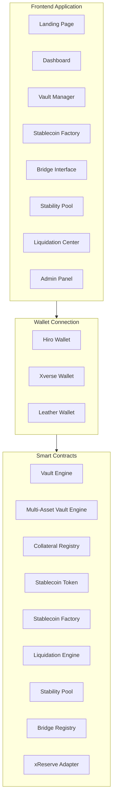
```mermaid
flowchart TB
    subgraph Frontend["Frontend Application"]
        Landing[Landing Page]
        Dashboard[Dashboard]
        Vaults[Vault Manager]
        Factory[Stablecoin Factory]
        Bridge[Bridge Interface]
        Pool[Stability Pool]
        Liquidations[Liquidation Center]
        Admin[Admin Panel]
    end
    
    subgraph Wallet["Wallet Connection"]
        Hiro[Hiro Wallet]
        Xverse[Xverse Wallet]
        Leather[Leather Wallet]
    end
    
    subgraph Contracts["Smart Contracts"]
        VE[Vault Engine]
        MAVE[Multi-Asset Vault Engine]
        CR[Collateral Registry]
        ST[Stablecoin Token]
        SF[Stablecoin Factory]
        LE[Liquidation Engine]
        SP[Stability Pool]
        BR[Bridge Registry]
        XR[xReserve Adapter]
    end
    
    Frontend --> Wallet
    Wallet --> Contracts
```

---

## Navigation Structure

### Main Navigation

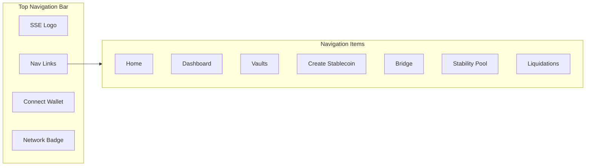
```mermaid
flowchart LR
    subgraph TopNav["Top Navigation Bar"]
        Logo[SSE Logo]
        NavLinks[Nav Links]
        WalletBtn[Connect Wallet]
        NetworkBadge[Network Badge]
    end
    
    subgraph NavItems["Navigation Items"]
        Home[Home]
        Dashboard[Dashboard]
        Vaults[Vaults]
        Create[Create Stablecoin]
        Bridge[Bridge]
        Pool[Stability Pool]
        Liquidate[Liquidations]
    end
    
    NavLinks --> NavItems
```

### Sidebar Navigation (Dashboard)

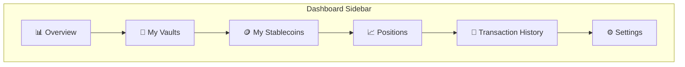
```mermaid
flowchart TB
    subgraph Sidebar["Dashboard Sidebar"]
        Overview[📊 Overview]
        MyVaults[🏦 My Vaults]
        MyStables[🪙 My Stablecoins]
        Positions[📈 Positions]
        History[📜 Transaction History]
        Settings[⚙️ Settings]
    end
    
    Overview --> MyVaults
    MyVaults --> MyStables
    MyStables --> Positions
    Positions --> History
    History --> Settings
```

---

## User Flows by Persona

### 1. Vault Owner Flows

#### 1.1 Connect Wallet & View Dashboard

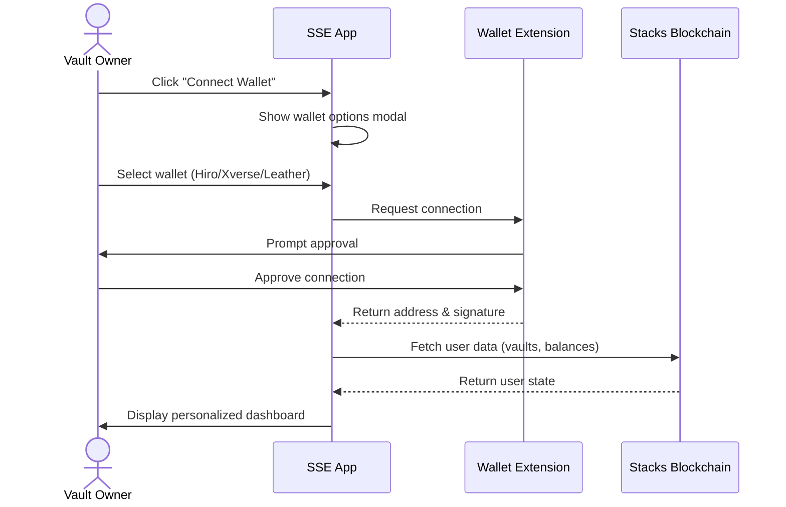
```mermaid
sequenceDiagram
    actor User as Vault Owner
    participant App as SSE App
    participant Wallet as Wallet Extension
    participant Chain as Stacks Blockchain
    
    User->>App: Click "Connect Wallet"
    App->>App: Show wallet options modal
    User->>App: Select wallet (Hiro/Xverse/Leather)
    App->>Wallet: Request connection
    Wallet->>User: Prompt approval
    User->>Wallet: Approve connection
    Wallet-->>App: Return address & signature
    App->>Chain: Fetch user data (vaults, balances)
    Chain-->>App: Return user state
    App->>User: Display personalized dashboard
```

#### 1.2 Open New Vault

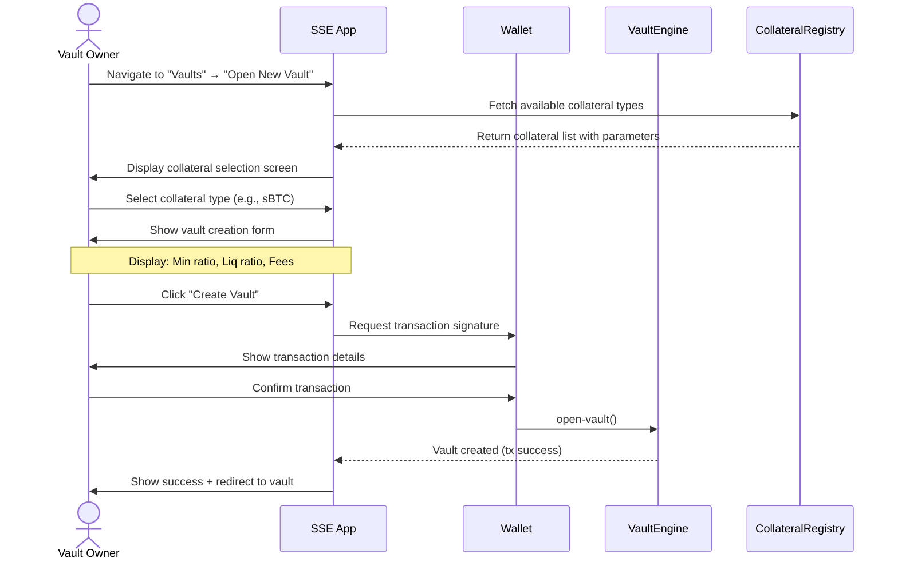
```mermaid
sequenceDiagram
    actor User as Vault Owner
    participant App as SSE App
    participant Wallet as Wallet
    participant VE as VaultEngine
    participant CR as CollateralRegistry
    
    User->>App: Navigate to "Vaults" → "Open New Vault"
    App->>CR: Fetch available collateral types
    CR-->>App: Return collateral list with parameters
    App->>User: Display collateral selection screen
    User->>App: Select collateral type (e.g., sBTC)
    App->>User: Show vault creation form
    Note over App,User: Display: Min ratio, Liq ratio, Fees
    User->>App: Click "Create Vault"
    App->>Wallet: Request transaction signature
    Wallet->>User: Show transaction details
    User->>Wallet: Confirm transaction
    Wallet->>VE: open-vault()
    VE-->>App: Vault created (tx success)
    App->>User: Show success + redirect to vault
```

#### 1.3 Deposit Collateral & Mint Stablecoins

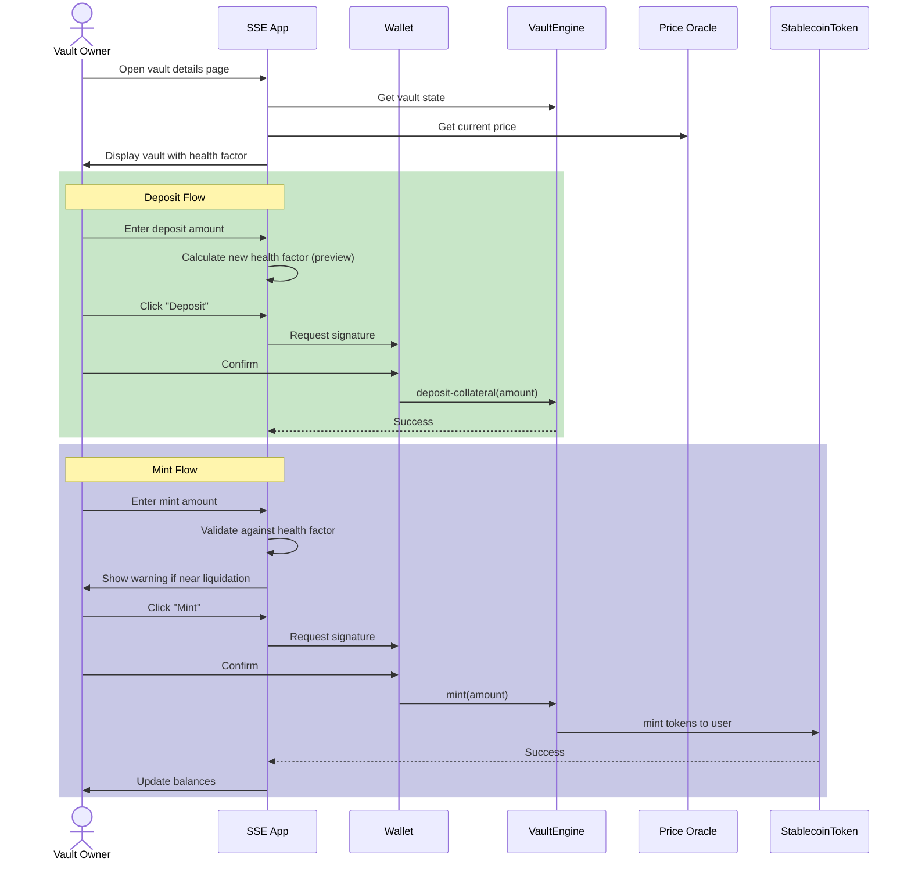
```mermaid
sequenceDiagram
    actor User as Vault Owner
    participant App as SSE App
    participant Wallet as Wallet
    participant VE as VaultEngine
    participant Oracle as Price Oracle
    participant ST as StablecoinToken
    
    User->>App: Open vault details page
    App->>VE: Get vault state
    App->>Oracle: Get current price
    App->>User: Display vault with health factor
    
    rect rgb(200, 230, 200)
        Note over User,App: Deposit Flow
        User->>App: Enter deposit amount
        App->>App: Calculate new health factor (preview)
        User->>App: Click "Deposit"
        App->>Wallet: Request signature
        User->>Wallet: Confirm
        Wallet->>VE: deposit-collateral(amount)
        VE-->>App: Success
    end
    
    rect rgb(200, 200, 230)
        Note over User,App: Mint Flow
        User->>App: Enter mint amount
        App->>App: Validate against health factor
        App->>User: Show warning if near liquidation
        User->>App: Click "Mint"
        App->>Wallet: Request signature
        User->>Wallet: Confirm
        Wallet->>VE: mint(amount)
        VE->>ST: mint tokens to user
        ST-->>App: Success
        App->>User: Update balances
    end
```

#### 1.4 Repay Debt & Withdraw Collateral

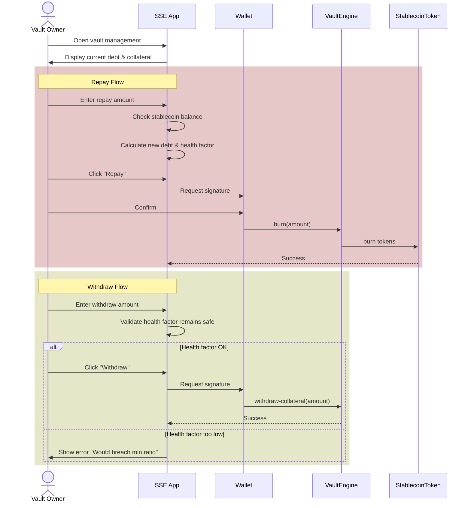
```mermaid
sequenceDiagram
    actor User as Vault Owner
    participant App as SSE App
    participant Wallet as Wallet
    participant VE as VaultEngine
    participant ST as StablecoinToken
    
    User->>App: Open vault management
    App->>User: Display current debt & collateral
    
    rect rgb(230, 200, 200)
        Note over User,App: Repay Flow
        User->>App: Enter repay amount
        App->>App: Check stablecoin balance
        App->>App: Calculate new debt & health factor
        User->>App: Click "Repay"
        App->>Wallet: Request signature
        User->>Wallet: Confirm
        Wallet->>VE: burn(amount)
        VE->>ST: burn tokens
        ST-->>App: Success
    end
    
    rect rgb(230, 230, 200)
        Note over User,App: Withdraw Flow
        User->>App: Enter withdraw amount
        App->>App: Validate health factor remains safe
        alt Health factor OK
            User->>App: Click "Withdraw"
            App->>Wallet: Request signature
            Wallet->>VE: withdraw-collateral(amount)
            VE-->>App: Success
        else Health factor too low
            App->>User: Show error "Would breach min ratio"
        end
    end
```

#### 1.5 Multi-Asset Vault Management

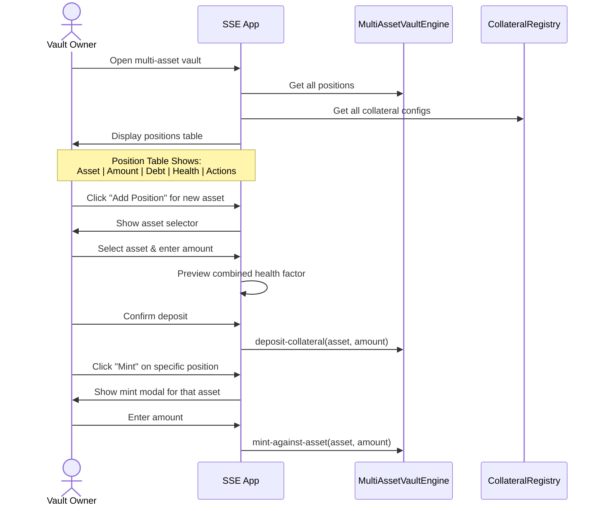
```mermaid
sequenceDiagram
    actor User as Vault Owner
    participant App as SSE App
    participant MAVE as MultiAssetVaultEngine
    participant CR as CollateralRegistry
    
    User->>App: Open multi-asset vault
    App->>MAVE: Get all positions
    App->>CR: Get all collateral configs
    App->>User: Display positions table
    
    Note over App,User: Position Table Shows:<br/>Asset | Amount | Debt | Health | Actions
    
    User->>App: Click "Add Position" for new asset
    App->>User: Show asset selector
    User->>App: Select asset & enter amount
    App->>App: Preview combined health factor
    User->>App: Confirm deposit
    App->>MAVE: deposit-collateral(asset, amount)
    
    User->>App: Click "Mint" on specific position
    App->>User: Show mint modal for that asset
    User->>App: Enter amount
    App->>MAVE: mint-against-asset(asset, amount)
```

---

### 2. Stablecoin Creator Flows

#### 2.1 Register New Stablecoin

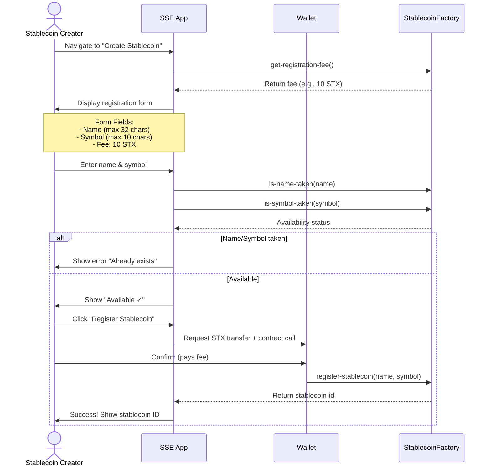
```mermaid
sequenceDiagram
    actor Creator as Stablecoin Creator
    participant App as SSE App
    participant Wallet as Wallet
    participant SF as StablecoinFactory
    
    Creator->>App: Navigate to "Create Stablecoin"
    App->>SF: get-registration-fee()
    SF-->>App: Return fee (e.g., 10 STX)
    App->>Creator: Display registration form
    
    Note over App,Creator: Form Fields:<br/>- Name (max 32 chars)<br/>- Symbol (max 10 chars)<br/>- Fee: 10 STX
    
    Creator->>App: Enter name & symbol
    App->>SF: is-name-taken(name)
    App->>SF: is-symbol-taken(symbol)
    SF-->>App: Availability status
    
    alt Name/Symbol taken
        App->>Creator: Show error "Already exists"
    else Available
        App->>Creator: Show "Available ✓"
        Creator->>App: Click "Register Stablecoin"
        App->>Wallet: Request STX transfer + contract call
        Creator->>Wallet: Confirm (pays fee)
        Wallet->>SF: register-stablecoin(name, symbol)
        SF-->>App: Return stablecoin-id
        App->>Creator: Success! Show stablecoin ID
    end
```

#### 2.2 Link Token Contract

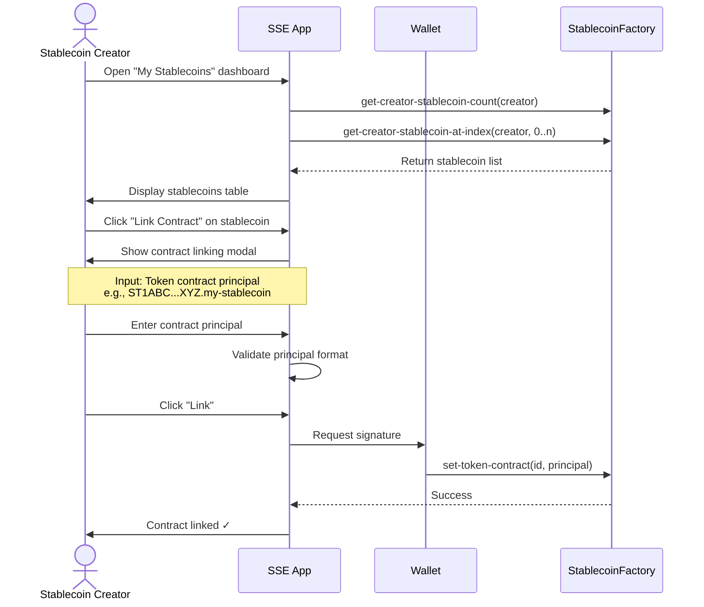
```mermaid
sequenceDiagram
    actor Creator as Stablecoin Creator
    participant App as SSE App
    participant Wallet as Wallet
    participant SF as StablecoinFactory
    
    Creator->>App: Open "My Stablecoins" dashboard
    App->>SF: get-creator-stablecoin-count(creator)
    App->>SF: get-creator-stablecoin-at-index(creator, 0..n)
    SF-->>App: Return stablecoin list
    App->>Creator: Display stablecoins table
    
    Creator->>App: Click "Link Contract" on stablecoin
    App->>Creator: Show contract linking modal
    
    Note over App,Creator: Input: Token contract principal<br/>e.g., ST1ABC...XYZ.my-stablecoin
    
    Creator->>App: Enter contract principal
    App->>App: Validate principal format
    Creator->>App: Click "Link"
    App->>Wallet: Request signature
    Wallet->>SF: set-token-contract(id, principal)
    SF-->>App: Success
    App->>Creator: Contract linked ✓
```

#### 2.3 View Stablecoin Analytics

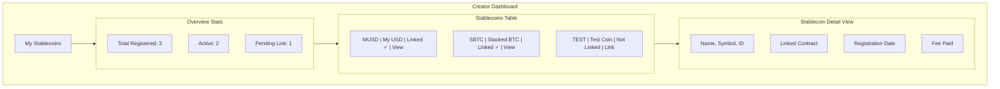
```mermaid
flowchart TB
    subgraph Dashboard["Creator Dashboard"]
        Header[My Stablecoins]
        
        subgraph Stats["Overview Stats"]
            Total[Total Registered: 3]
            Active[Active: 2]
            Pending[Pending Link: 1]
        end
        
        subgraph Table["Stablecoins Table"]
            Row1["MUSD | My USD | Linked ✓ | View"]
            Row2["SBTC | Stacked BTC | Linked ✓ | View"]
            Row3["TEST | Test Coin | Not Linked | Link"]
        end
        
        subgraph Detail["Stablecoin Detail View"]
            Info[Name, Symbol, ID]
            Contract[Linked Contract]
            Created[Registration Date]
            Fee[Fee Paid]
        end
    end
    
    Header --> Stats
    Stats --> Table
    Table --> Detail
```

---

### 3. Liquidator Flows

#### 3.1 Monitor Unhealthy Vaults

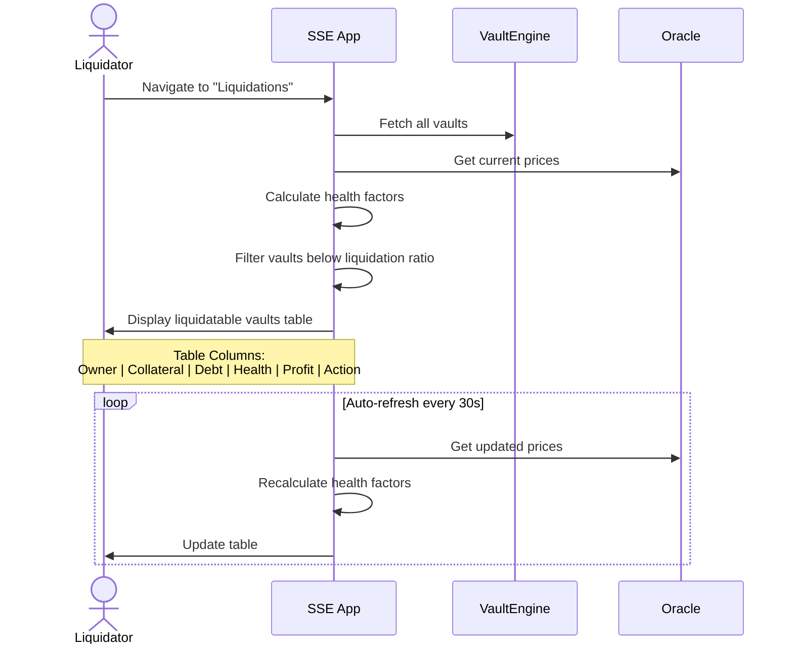
```mermaid
sequenceDiagram
    actor Liq as Liquidator
    participant App as SSE App
    participant VE as VaultEngine
    participant Oracle as Oracle
    
    Liq->>App: Navigate to "Liquidations"
    App->>VE: Fetch all vaults
    App->>Oracle: Get current prices
    App->>App: Calculate health factors
    App->>App: Filter vaults below liquidation ratio
    App->>Liq: Display liquidatable vaults table
    
    Note over App,Liq: Table Columns:<br/>Owner | Collateral | Debt | Health | Profit | Action
    
    loop Auto-refresh every 30s
        App->>Oracle: Get updated prices
        App->>App: Recalculate health factors
        App->>Liq: Update table
    end
```

#### 3.2 Execute Liquidation

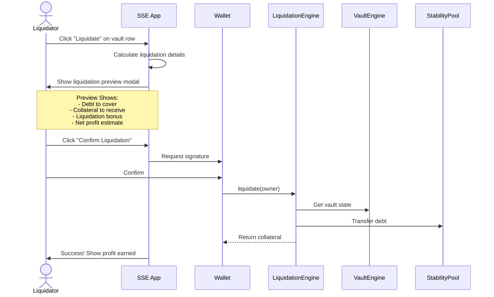
```mermaid
sequenceDiagram
    actor Liq as Liquidator
    participant App as SSE App
    participant Wallet as Wallet
    participant LE as LiquidationEngine
    participant VE as VaultEngine
    participant SP as StabilityPool
    
    Liq->>App: Click "Liquidate" on vault row
    App->>App: Calculate liquidation details
    App->>Liq: Show liquidation preview modal
    
    Note over App,Liq: Preview Shows:<br/>- Debt to cover<br/>- Collateral to receive<br/>- Liquidation bonus<br/>- Net profit estimate
    
    Liq->>App: Click "Confirm Liquidation"
    App->>Wallet: Request signature
    Liq->>Wallet: Confirm
    Wallet->>LE: liquidate(owner)
    LE->>VE: Get vault state
    LE->>SP: Transfer debt
    LE-->>Wallet: Return collateral
    App->>Liq: Success! Show profit earned
```

#### 3.3 Liquidation Dashboard

```mermaid
flowchart TB
    subgraph LiqDash["Liquidation Dashboard"]
        subgraph Filters["Filters & Sorting"]
            AssetFilter[Filter by Asset]
            HealthSort[Sort by Health Factor]
            ProfitSort[Sort by Profit]
        end
        
        subgraph Metrics["Key Metrics"]
            TotalLiq[Total Liquidatable: $1.2M]
            AvgProfit[Avg Profit: 8%]
            MyLiqs[My Liquidations: 12]
        end
        
        subgraph VaultList["Liquidatable Vaults"]
            V1["0x1a2b... | 1.5 sBTC | $45K debt | 115% | $4.5K profit | ⚡"]
            V2["0x3c4d... | 2.0 sBTC | $60K debt | 118% | $5.4K profit | ⚡"]
            V3["0x5e6f... | 0.8 sBTC | $24K debt | 119% | $2.1K profit | ⚡"]
        end
        
        subgraph History["My Liquidation History"]
            H1["2024-03-24 | 0x7g8h... | +$3.2K | ✓"]
            H2["2024-03-23 | 0x9i0j... | +$1.8K | ✓"]
        end
    end
    
    Filters --> Metrics
    Metrics --> VaultList
    VaultList --> History
```

---

### 4. Bridge User Flows

#### 4.1 Bridge from Ethereum to Stacks (Deposit)

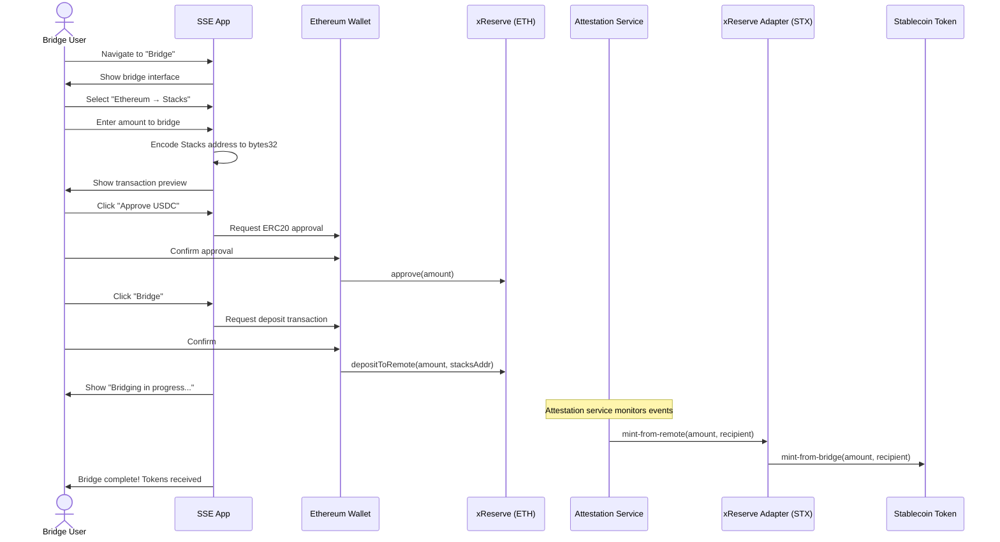
```mermaid
sequenceDiagram
    actor User as Bridge User
    participant App as SSE App
    participant EthWallet as Ethereum Wallet
    participant xReserve as xReserve (ETH)
    participant Attestation as Attestation Service
    participant XRA as xReserve Adapter (STX)
    participant ST as Stablecoin Token
    
    User->>App: Navigate to "Bridge"
    App->>User: Show bridge interface
    User->>App: Select "Ethereum → Stacks"
    User->>App: Enter amount to bridge
    App->>App: Encode Stacks address to bytes32
    App->>User: Show transaction preview
    
    User->>App: Click "Approve USDC"
    App->>EthWallet: Request ERC20 approval
    User->>EthWallet: Confirm approval
    EthWallet->>xReserve: approve(amount)
    
    User->>App: Click "Bridge"
    App->>EthWallet: Request deposit transaction
    User->>EthWallet: Confirm
    EthWallet->>xReserve: depositToRemote(amount, stacksAddr)
    
    App->>User: Show "Bridging in progress..."
    
    Note over Attestation: Attestation service monitors events
    Attestation->>XRA: mint-from-remote(amount, recipient)
    XRA->>ST: mint-from-bridge(amount, recipient)
    
    App->>User: Bridge complete! Tokens received
```

#### 4.2 Bridge from Stacks to Ethereum (Withdraw)

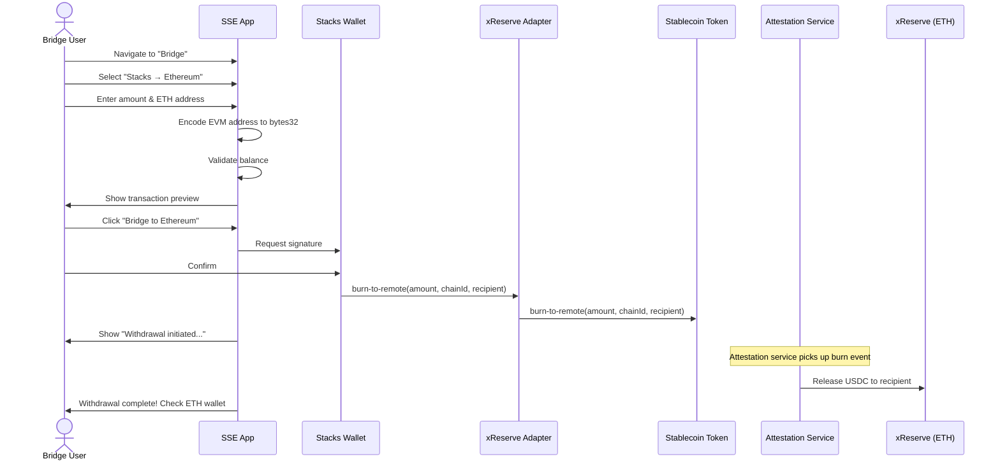
```mermaid
sequenceDiagram
    actor User as Bridge User
    participant App as SSE App
    participant StacksWallet as Stacks Wallet
    participant XRA as xReserve Adapter
    participant ST as Stablecoin Token
    participant Attestation as Attestation Service
    participant xReserve as xReserve (ETH)
    
    User->>App: Navigate to "Bridge"
    User->>App: Select "Stacks → Ethereum"
    User->>App: Enter amount & ETH address
    App->>App: Encode EVM address to bytes32
    App->>App: Validate balance
    App->>User: Show transaction preview
    
    User->>App: Click "Bridge to Ethereum"
    App->>StacksWallet: Request signature
    User->>StacksWallet: Confirm
    StacksWallet->>XRA: burn-to-remote(amount, chainId, recipient)
    XRA->>ST: burn-to-remote(amount, chainId, recipient)
    
    App->>User: Show "Withdrawal initiated..."
    
    Note over Attestation: Attestation service picks up burn event
    Attestation->>xReserve: Release USDC to recipient
    
    App->>User: Withdrawal complete! Check ETH wallet
```

#### 4.3 Bridge Status Tracking

```mermaid
flowchart TB
    subgraph BridgeUI["Bridge Interface"]
        subgraph Direction["Direction Selector"]
            EthToStx["ETH → STX"]
            StxToEth["STX → ETH"]
        end
        
        subgraph Form["Bridge Form"]
            Amount[Amount Input]
            FromAddr[From Address]
            ToAddr[To Address]
            Fee[Bridge Fee Display]
            Preview[Transaction Preview]
        end
        
        subgraph Status["Transaction Status"]
            Pending["⏳ Pending Confirmation"]
            Processing["🔄 Processing on Bridge"]
            Complete["✅ Complete"]
            Failed["❌ Failed - Retry"]
        end
        
        subgraph History["Bridge History"]
            TX1["0x123... | 100 USDC | ETH→STX | ✅"]
            TX2["0x456... | 50 USDC | STX→ETH | 🔄"]
        end
    end
    
    Direction --> Form
    Form --> Status
    Status --> History
```

---

### 5. Stability Pool Provider Flows

#### 5.1 Deposit to Stability Pool

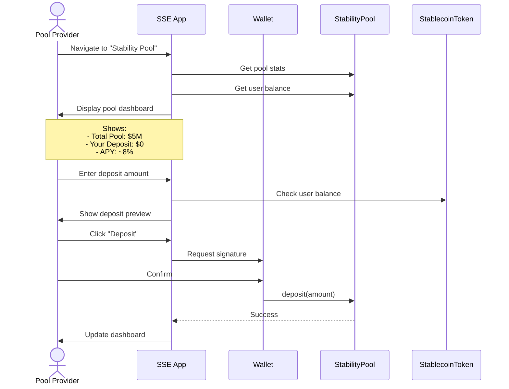
```mermaid
sequenceDiagram
    actor Provider as Pool Provider
    participant App as SSE App
    participant Wallet as Wallet
    participant SP as StabilityPool
    participant ST as StablecoinToken
    
    Provider->>App: Navigate to "Stability Pool"
    App->>SP: Get pool stats
    App->>SP: Get user balance
    App->>Provider: Display pool dashboard
    
    Note over App,Provider: Shows:<br/>- Total Pool: $5M<br/>- Your Deposit: $0<br/>- APY: ~8%
    
    Provider->>App: Enter deposit amount
    App->>ST: Check user balance
    App->>Provider: Show deposit preview
    Provider->>App: Click "Deposit"
    App->>Wallet: Request signature
    Provider->>Wallet: Confirm
    Wallet->>SP: deposit(amount)
    SP-->>App: Success
    App->>Provider: Update dashboard
```

#### 5.2 Withdraw from Stability Pool

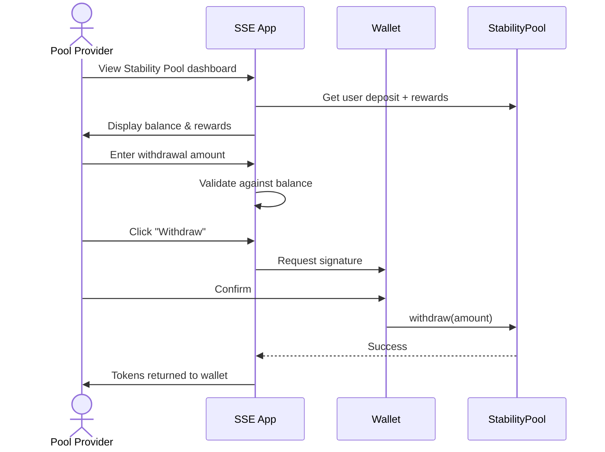
```mermaid
sequenceDiagram
    actor Provider as Pool Provider
    participant App as SSE App
    participant Wallet as Wallet
    participant SP as StabilityPool
    
    Provider->>App: View Stability Pool dashboard
    App->>SP: Get user deposit + rewards
    App->>Provider: Display balance & rewards
    
    Provider->>App: Enter withdrawal amount
    App->>App: Validate against balance
    Provider->>App: Click "Withdraw"
    App->>Wallet: Request signature
    Provider->>Wallet: Confirm
    Wallet->>SP: withdraw(amount)
    SP-->>App: Success
    App->>Provider: Tokens returned to wallet
```

#### 5.3 Stability Pool Dashboard

```mermaid
flowchart TB
    subgraph PoolDash["Stability Pool Dashboard"]
        subgraph PoolStats["Pool Statistics"]
            TotalDeposits[Total Deposits: $5.2M]
            TotalProviders[Providers: 1,234]
            AvgAPY[Current APY: 8.5%]
        end
        
        subgraph UserStats["Your Position"]
            YourDeposit[Your Deposit: $10,000]
            YourShare[Pool Share: 0.19%]
            Rewards[Pending Rewards: $45.20]
        end
        
        subgraph Actions["Actions"]
            DepositBtn[Deposit More]
            WithdrawBtn[Withdraw]
            ClaimBtn[Claim Rewards]
        end
        
        subgraph Chart["Pool Performance Chart"]
            TVLChart[TVL Over Time]
            APYChart[APY History]
        end
    end
    
    PoolStats --> UserStats
    UserStats --> Actions
    Actions --> Chart
```

---

### 6. Protocol Admin Flows

#### 6.1 Manage Collateral Types

```mermaid
sequenceDiagram
    actor Admin as Protocol Admin
    participant App as Admin Panel
    participant Wallet as Wallet
    participant CR as CollateralRegistry
    
    Admin->>App: Navigate to Admin → Collateral
    App->>CR: get-collateral-count()
    App->>CR: get-collateral-at-index(0..n)
    App->>Admin: Display collateral table
    
    Admin->>App: Click "Add Collateral Type"
    App->>Admin: Show configuration form
    
    Note over App,Admin: Form Fields:<br/>- Asset Principal<br/>- Min Collateral Ratio<br/>- Liquidation Ratio<br/>- Liquidation Penalty<br/>- Stability Fee<br/>- Debt Ceiling<br/>- Debt Floor<br/>- Oracle Address
    
    Admin->>App: Fill form & submit
    App->>Wallet: Request signature
    Admin->>Wallet: Confirm
    Wallet->>CR: add-collateral-type(...)
    CR-->>App: Success
    App->>Admin: Collateral added ✓
```

#### 6.2 Update Registration Fee

```mermaid
sequenceDiagram
    actor Admin as Protocol Admin
    participant App as Admin Panel
    participant Wallet as Wallet
    participant SF as StablecoinFactory
    
    Admin->>App: Navigate to Admin → Factory Settings
    App->>SF: get-registration-fee()
    App->>SF: get-treasury-address()
    App->>Admin: Display current settings
    
    Admin->>App: Enter new fee amount
    Admin->>App: Click "Update Fee"
    App->>Wallet: Request signature
    Admin->>Wallet: Confirm
    Wallet->>SF: set-registration-fee(newFee)
    SF-->>App: Success
    App->>Admin: Fee updated ✓
```

#### 6.3 Admin Dashboard

```mermaid
flowchart TB
    subgraph AdminPanel["Admin Panel"]
        subgraph Overview["Protocol Overview"]
            TVL[Total TVL: $50M]
            TotalVaults[Active Vaults: 5,432]
            TotalStables[Registered Stablecoins: 15]
            Treasury[Treasury Balance: 1,500 STX]
        end
        
        subgraph Sections["Admin Sections"]
            CollateralMgmt[Collateral Management]
            FactorySettings[Factory Settings]
            OracleConfig[Oracle Configuration]
            BridgeConfig[Bridge Configuration]
            EmergencyControls[Emergency Controls]
        end
        
        subgraph CollateralTable["Collateral Types"]
            C1["sBTC | 150% | 120% | 10% | Active | Edit"]
            C2["STX | 200% | 150% | 15% | Active | Edit"]
            C3["xUSD | 110% | 105% | 5% | Disabled | Enable"]
        end
        
        subgraph FactoryConfig["Factory Configuration"]
            CurrentFee[Current Fee: 10 STX]
            TreasuryAddr[Treasury: ST1ABC...]
            UpdateFee[Update Fee]
            UpdateTreasury[Update Treasury]
        end
    end
    
    Overview --> Sections
    Sections --> CollateralTable
    Sections --> FactoryConfig
```

---

## Screen Specifications

### 1. Landing Page

```mermaid
flowchart TB
    subgraph Landing["Landing Page"]
        subgraph Hero["Hero Section"]
            Headline["Bitcoin-Backed Stablecoins on Stacks"]
            Subhead["Create, manage, and bridge overcollateralized stablecoins"]
            CTAButtons["[Launch App] [Documentation]"]
        end
        
        subgraph Stats["Protocol Stats"]
            TVL["$50M+ TVL"]
            Vaults["5,000+ Vaults"]
            Stables["15 Stablecoins"]
        end
        
        subgraph Features["Key Features"]
            F1["🏦 Multi-Asset Vaults"]
            F2["🌉 Cross-Chain Bridge"]
            F3["🪙 Create Stablecoins"]
            F4["💰 Earn in Stability Pool"]
        end
        
        subgraph HowItWorks["How It Works"]
            Step1["1. Connect Wallet"]
            Step2["2. Deposit Collateral"]
            Step3["3. Mint Stablecoins"]
            Step4["4. Use Anywhere"]
        end
        
        Footer["Footer: Links, Docs, Social"]
    end
    
    Hero --> Stats
    Stats --> Features
    Features --> HowItWorks
    HowItWorks --> Footer
```

### 2. Dashboard

```mermaid
flowchart TB
    subgraph Dashboard["User Dashboard"]
        subgraph Header["Dashboard Header"]
            Welcome["Welcome back, 0x1a2b..."]
            NetWorth["Net Worth: $125,430"]
        end
        
        subgraph QuickStats["Quick Stats Cards"]
            Card1["Total Collateral<br/>$150,000"]
            Card2["Total Debt<br/>$75,000"]
            Card3["Health Factor<br/>200%"]
            Card4["Stablecoin Balance<br/>$50,000"]
        end
        
        subgraph VaultSummary["My Vaults Summary"]
            VaultTable["Vault | Collateral | Debt | Health | Actions"]
            V1["sBTC Vault | $100K | $50K | 200% | Manage"]
            V2["STX Vault | $50K | $25K | 200% | Manage"]
        end
        
        subgraph Activity["Recent Activity"]
            A1["Deposited 0.5 sBTC - 2h ago"]
            A2["Minted 10,000 MUSD - 1d ago"]
            A3["Repaid 5,000 MUSD - 3d ago"]
        end
    end
    
    Header --> QuickStats
    QuickStats --> VaultSummary
    VaultSummary --> Activity
```

### 3. Vault Management Screen

```mermaid
flowchart TB
    subgraph VaultMgmt["Vault Management"]
        subgraph VaultHeader["Vault Header"]
            VaultName["sBTC Vault #1234"]
            Status["Status: Healthy ✓"]
        end
        
        subgraph Metrics["Key Metrics"]
            Collateral["Collateral: 2.5 sBTC ($150,000)"]
            Debt["Debt: 50,000 MUSD"]
            Health["Health Factor: 300%"]
            LiqPrice["Liquidation Price: $13,333"]
        end
        
        subgraph ActionPanel["Action Panel"]
            subgraph DepositWithdraw["Collateral"]
                DepositInput["Amount: [____] sBTC"]
                DepositBtn["[Deposit]"]
                WithdrawBtn["[Withdraw]"]
            end
            
            subgraph MintRepay["Debt"]
                DebtInput["Amount: [____] MUSD"]
                MintBtn["[Mint]"]
                RepayBtn["[Repay]"]
            end
        end
        
        subgraph Preview["Transaction Preview"]
            NewHealth["New Health Factor: 250%"]
            Warning["⚠️ Warning: Approaching liquidation"]
        end
        
        subgraph History["Vault History"]
            H1["Deposit | +0.5 sBTC | Mar 24"]
            H2["Mint | +10,000 MUSD | Mar 23"]
        end
    end
    
    VaultHeader --> Metrics
    Metrics --> ActionPanel
    ActionPanel --> Preview
    Preview --> History
```

### 4. Create Stablecoin Screen

```mermaid
flowchart TB
    subgraph CreateStable["Create Stablecoin"]
        subgraph FormHeader["Header"]
            Title["Register New Stablecoin"]
            Fee["Registration Fee: 10 STX"]
        end
        
        subgraph Form["Registration Form"]
            NameField["Name: [________________]<br/>Max 32 characters"]
            NameStatus["✓ Available / ✗ Taken"]
            
            SymbolField["Symbol: [______]<br/>Max 10 characters"]
            SymbolStatus["✓ Available / ✗ Taken"]
            
            Preview["Preview: My Stablecoin (MUSD)"]
        end
        
        subgraph Summary["Summary"]
            SumName["Name: My Stablecoin"]
            SumSymbol["Symbol: MUSD"]
            SumFee["Fee: 10 STX"]
            SumTotal["Total Cost: 10 STX + gas"]
        end
        
        subgraph Actions["Actions"]
            RegisterBtn["[Register Stablecoin]"]
            Cancel["[Cancel]"]
        end
    end
    
    FormHeader --> Form
    Form --> Summary
    Summary --> Actions
```

### 5. Bridge Interface

```mermaid
flowchart TB
    subgraph BridgeScreen["Bridge Interface"]
        subgraph DirectionToggle["Direction"]
            EthStx["[ETH → STX]"]
            StxEth["[STX → ETH]"]
        end
        
        subgraph FromSection["From"]
            FromChain["Chain: Ethereum"]
            FromToken["Token: USDC"]
            FromAmount["Amount: [________]"]
            FromBalance["Balance: 10,000 USDC"]
            MaxBtn["[MAX]"]
        end
        
        subgraph Arrow[""]
            SwapArrow["⬇️"]
        end
        
        subgraph ToSection["To"]
            ToChain["Chain: Stacks"]
            ToToken["Token: USDC (bridged)"]
            ToAmount["You receive: 9,950 USDC"]
            ToAddress["Recipient: ST1ABC..."]
        end
        
        subgraph FeeBreakdown["Fees"]
            BridgeFee["Bridge Fee: 0.5%"]
            GasFee["Est. Gas: ~$5"]
            Total["Total Cost: ~$55"]
        end
        
        subgraph BridgeAction[""]
            BridgeBtn["[Bridge Tokens]"]
        end
    end
    
    DirectionToggle --> FromSection
    FromSection --> Arrow
    Arrow --> ToSection
    ToSection --> FeeBreakdown
    FeeBreakdown --> BridgeAction
```

---

## Component Library

### Buttons

```mermaid
flowchart LR
    subgraph Buttons["Button Components"]
        Primary["[Primary Action]<br/>Blue, filled"]
        Secondary["[Secondary]<br/>Outlined"]
        Danger["[Danger]<br/>Red, for destructive"]
        Disabled["[Disabled]<br/>Grayed out"]
        Loading["[Loading...]<br/>With spinner"]
        Icon["[🔗 With Icon]"]
    end
```

### Cards

```mermaid
flowchart TB
    subgraph Cards["Card Components"]
        subgraph StatCard["Stat Card"]
            StatLabel["Total Value Locked"]
            StatValue["$50,000,000"]
            StatChange["+5.2% ↑"]
        end
        
        subgraph VaultCard["Vault Card"]
            VaultIcon["🏦"]
            VaultTitle["sBTC Vault"]
            VaultStats["$100K collateral | 200% health"]
            VaultAction["[Manage →]"]
        end
        
        subgraph AlertCard["Alert Card"]
            AlertIcon["⚠️"]
            AlertMsg["Your vault health is below 150%"]
            AlertAction["[Add Collateral]"]
        end
    end
```

### Modals

```mermaid
flowchart TB
    subgraph Modals["Modal Components"]
        subgraph ConfirmModal["Confirmation Modal"]
            ConfirmTitle["Confirm Transaction"]
            ConfirmDetails["You are about to mint 10,000 MUSD"]
            ConfirmWarning["⚠️ This will reduce health to 180%"]
            ConfirmBtns["[Cancel] [Confirm]"]
        end
        
        subgraph WalletModal["Wallet Selection"]
            WalletTitle["Connect Wallet"]
            Wallet1["🦊 Hiro Wallet"]
            Wallet2["⚡ Xverse"]
            Wallet3["🔷 Leather"]
        end
        
        subgraph TxModal["Transaction Status"]
            TxTitle["Transaction Pending"]
            TxSpinner["🔄 Confirming..."]
            TxHash["Tx: 0x1234..."]
            TxExplorer["[View on Explorer]"]
        end
    end
```

### Form Elements

```mermaid
flowchart TB
    subgraph Forms["Form Components"]
        subgraph InputField["Input Field"]
            Label["Amount"]
            Input["[__________]"]
            Helper["Enter amount in STX"]
            Error["❌ Insufficient balance"]
        end
        
        subgraph TokenInput["Token Input"]
            TokenLabel["Deposit"]
            TokenAmount["[1000]"]
            TokenSelect["[sBTC ▼]"]
            TokenMax["[MAX]"]
            TokenUSD["≈ $60,000"]
        end
        
        subgraph Slider["Slider Input"]
            SliderLabel["Collateral Ratio"]
            SliderTrack["[====●=====]"]
            SliderValue["150%"]
            SliderRange["Min: 120% | Max: 300%"]
        end
    end
```

### Tables

```mermaid
flowchart TB
    subgraph Tables["Table Components"]
        subgraph DataTable["Data Table"]
            THeader["Asset | Balance | Value | Actions"]
            TRow1["sBTC | 2.5 | $150,000 | [Manage]"]
            TRow2["STX | 50,000 | $25,000 | [Manage]"]
            TRow3["MUSD | 75,000 | $75,000 | [Transfer]"]
            TPagination["< 1 2 3 ... 10 >"]
        end
        
        subgraph SortFilter["Sort & Filter"]
            SortBy["Sort by: [Value ▼]"]
            FilterBy["Filter: [All Assets ▼]"]
            Search["🔍 Search..."]
        end
    end
```

### Notifications

```mermaid
flowchart LR
    subgraph Notifications["Notification Types"]
        Success["✅ Transaction confirmed!"]
        Error["❌ Transaction failed"]
        Warning["⚠️ Health factor low"]
        Info["ℹ️ New feature available"]
        Loading["🔄 Processing..."]
    end
```

---

## Responsive Breakpoints

| Breakpoint | Width | Layout |
|------------|-------|--------|
| Mobile | < 640px | Single column, bottom nav |
| Tablet | 640-1024px | Two columns, collapsible sidebar |
| Desktop | > 1024px | Full layout with sidebar |

---

## Color Palette

| Color | Hex | Usage |
|-------|-----|-------|
| Primary Blue | #3B82F6 | Primary actions, links |
| Success Green | #10B981 | Success states, healthy |
| Warning Yellow | #F59E0B | Warnings, caution |
| Danger Red | #EF4444 | Errors, liquidation risk |
| Background Dark | #111827 | Dark mode background |
| Background Light | #F9FAFB | Light mode background |
| Text Primary | #1F2937 | Main text |
| Text Secondary | #6B7280 | Secondary text |

---

## Accessibility Requirements

- **Keyboard Navigation**: All interactive elements accessible via Tab
- **Screen Readers**: ARIA labels on all buttons and inputs
- **Color Contrast**: Minimum 4.5:1 ratio for text
- **Focus States**: Visible focus indicators on all elements
- **Error Messages**: Clear, descriptive error text
- **Loading States**: Announce loading to screen readers

---

## Animation Guidelines

| Element | Animation | Duration |
|---------|-----------|----------|
| Page transitions | Fade in | 200ms |
| Modal open | Scale + fade | 150ms |
| Button hover | Background color | 100ms |
| Notifications | Slide in from top | 300ms |
| Loading spinners | Rotate | Infinite |
| Health factor change | Number count | 500ms |
