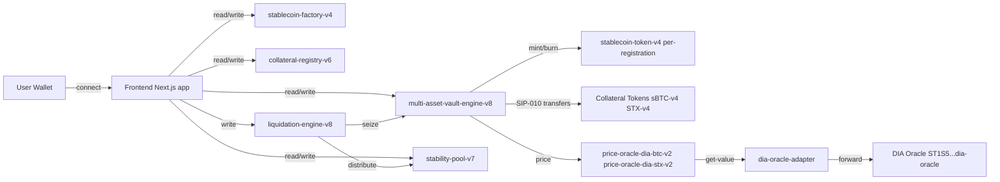
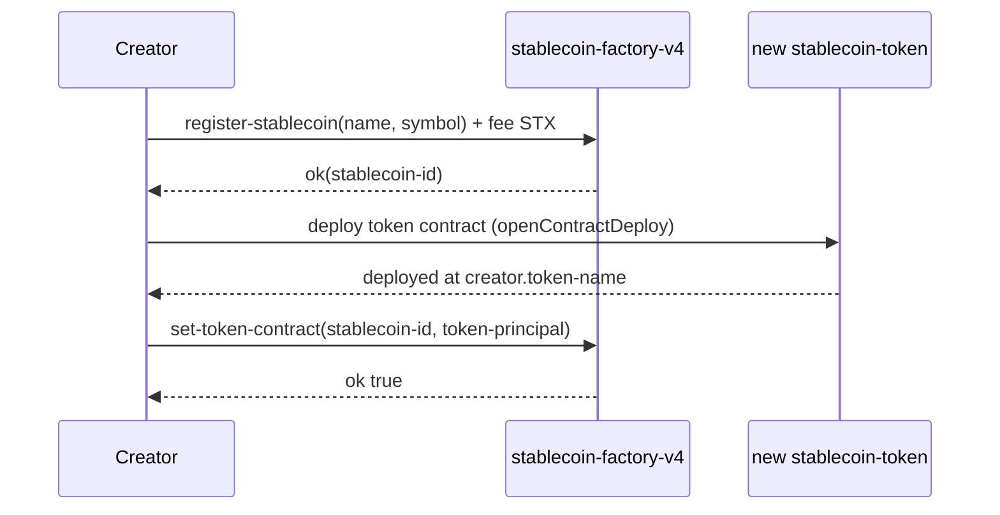
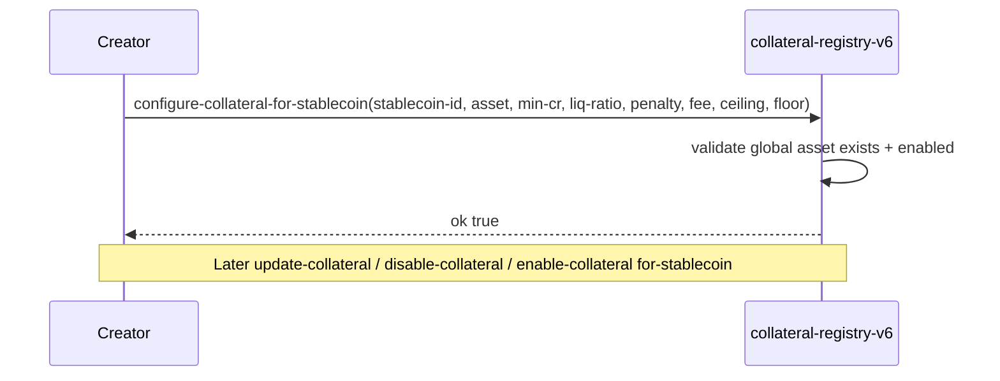
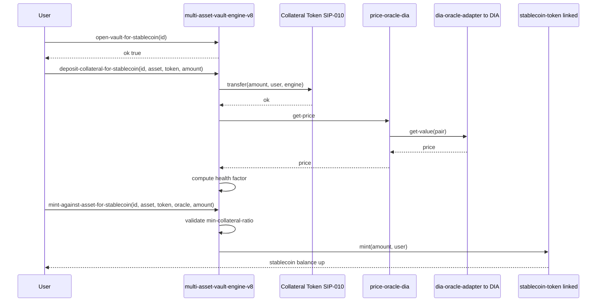
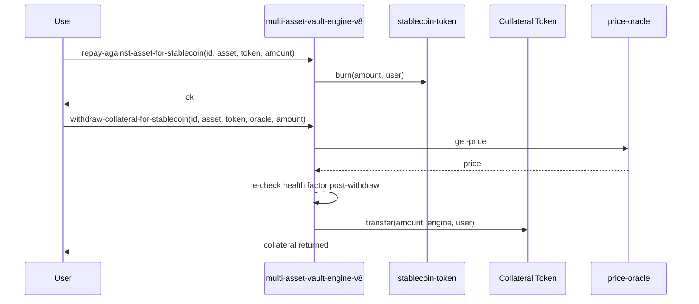
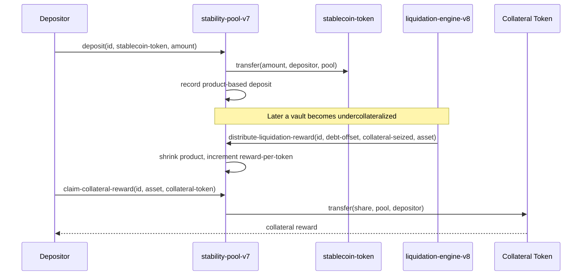
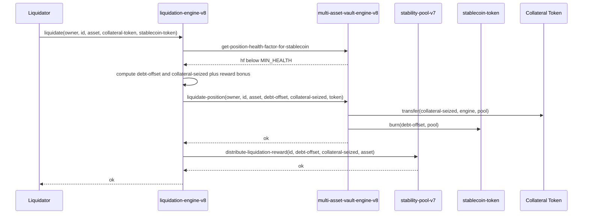
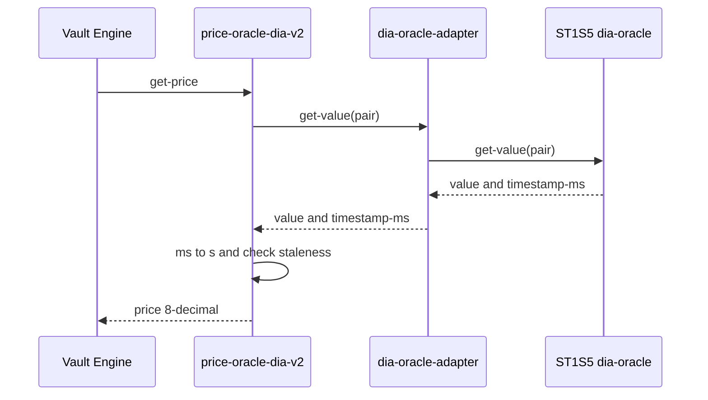

# Getting Started with SSE

> **Stacks Stablecoin Engine (SSE)** is an infrastructure layer for launching and operating **overcollateralized stablecoins** on Stacks, secured by sBTC and STX collateral. Creators register stablecoins; users open vaults and mint against them.

- **Live app**: https://app.stablecoin-engine.com/vaults
- **Network**: Stacks Testnet
- **Deployer**: `ST3DGG4B53XA12A6NQTXWK4346YPTC3B2B0ATA6HF`
- **Source**: this repository

---

## Documentation Map

| Doc | Purpose |
|---|---|
| [`README.md`](../README.md) | Project overview, installation, contract breakdown, deployment |
| [`docs/getting_started.md`](./getting_started.md) | **This file** — combined user + technical reference |
| [`docs/SSE_CONTEXT.md`](./SSE_CONTEXT.md) | Product intent, consistency rules, implementation status |
| [`docs/roadmap.md`](./roadmap.md) | Feature-by-feature status and roadmap (contract vs frontend coverage) |
| [`docs/adl/user_flows.md`](./adl/user_flows.md) | Long-form user-flow specifications |
| [`docs/adl/crosschain.md`](./adl/crosschain.md) | Cross-chain bridge design notes (out of MVP scope) |
| [`AGENTS.md`](../AGENTS.md) | Repository rules for coding agents |
| [`sse.config.json`](../sse.config.json) | Single source of truth for deployed contract names |

---

## Quickstart (5 minutes on Testnet)

1. Install a Stacks wallet (Leather or Xverse) and switch it to **Testnet**.
2. Visit https://app.stablecoin-engine.com/vaults and connect your wallet.
3. On the home page, use the **Testnet Faucet** section to mint 10 sBTC and 10 STX to your address.
4. Go to `/factory`, register a stablecoin (e.g. `MyUSD` / `mUSD`), deploy and link its token contract, then configure accepted collateral.
5. Go to `/vaults/new`, open a vault against your stablecoin, deposit collateral, and mint.
6. Optionally deposit stablecoins into `/pool` to earn liquidation rewards.

---

## User Personas

SSE is multi-sided. Five roles interact with the protocol:

| Persona | What they do | Primary frontend | Primary contracts |
|---|---|---|---|
| **Vault Owner** | Deposit collateral, mint stablecoins, repay, withdraw | `/vaults`, `/vaults/new`, `/vaults/[id]` | `multi-asset-vault-engine-v8` |
| **Stablecoin Creator** | Register stablecoin, deploy & link token, configure per-stablecoin collateral, set stability-pool reward % | `/factory` | `stablecoin-factory-v4`, `collateral-registry-v6`, `stability-pool-v7` |
| **Pool Depositor** | Deposit stablecoins into the stability pool, claim seized collateral from liquidations | `/pool` | `stability-pool-v7` |
| **Liquidator** | Call `liquidate` on undercollateralized vaults; net profit comes from reward bonus to the pool they deposited in | `/liquidations` | `liquidation-engine-v8` |
| **Protocol Admin** | Set registration fee, treasury, add global collateral types (per-asset oracle stored in registry), authorize engines | none (scripts only) | `stablecoin-factory-v4`, `collateral-registry-v6`, `multi-asset-vault-engine-v8`, `stablecoin-token-v4` |

> **Active vs legacy versions.** The active contract set is `multi-asset-vault-engine-v8`, `stability-pool-v7`, and `liquidation-engine-v8`. The pre-upgrade `multi-asset-vault-engine-v7`, `stability-pool-v6`, and `liquidation-engine-v7` remain on-chain (and v7 is still authorized) but are **deprecated legacy** — integrate against the v8 set. The key behavior change: v8 uses **trait-based oracle dispatch** (oracle read from `collateral-registry-v6`), so `mint-against-asset*` / `withdraw-collateral*` take an `<oracle-trait>` argument and the old `register-asset-oracle` admin function no longer exists.

### Capability matrix

| Action | Vault Owner | Creator | Pool Depositor | Liquidator | Admin |
|---|:-:|:-:|:-:|:-:|:-:|
| Register stablecoin | | Yes | | | |
| Link token contract to stablecoin | | Yes (own) | | | |
| Configure per-stablecoin collateral | | Yes (own) | | | |
| Set pool liquidation-reward % | | Yes (own) | | | |
| Open vault | Yes | | | | |
| Deposit / withdraw collateral | Yes | | | | |
| Mint / repay stablecoin debt | Yes | | | | |
| Deposit / withdraw pool stablecoins | | | Yes | | |
| Claim seized collateral reward | | | Yes | | |
| Liquidate undercollateralized vault | | | | Yes | |
| Add global collateral type | | | | | Yes |
| Set registration fee / treasury | | | | | Yes |
| Authorize vault engines | | | | | Yes |
| Register asset→oracle mapping (legacy v7 only; v8 reads oracle from registry) | | | | | Yes |

---

## Technical Architecture



### Contract-to-frontend page map

| Frontend page | Reads | Writes |
|---|---|---|
| `/` home | registered stablecoin count | faucet mint (sBTC-v3, STX-v3) |
| `/factory` | factory listings, registry config | `register-stablecoin`, `set-token-contract`, `configure/update/disable/enable-collateral-for-stablecoin`, `set-liquidation-reward-pct` |
| `/vaults` | user vaults + positions, health factors | refresh only |
| `/vaults/new` | stablecoins, collateral config, oracle prices | `open-vault-for-stablecoin`, `deposit-collateral-for-stablecoin`, `mint-against-asset-for-stablecoin` |
| `/vaults/[stablecoinId]` | vault, positions, health factor, max-mintable | `repay-against-asset-for-stablecoin`, `withdraw-collateral-for-stablecoin`, `mint-against-asset-for-stablecoin`, `deposit-collateral-for-stablecoin` |
| `/pool` | balances, rewards, total deposits, reward pct | `deposit`, `withdraw`, `claim-collateral-reward` |
| `/liquidations` | (placeholder list) | `liquidate` |
| `/dashboard` | (placeholder aggregates) | — |

---

## Sequence Diagrams

### 1. Register stablecoin and link token



### 2. Configure collateral for a stablecoin



### 3. Open vault, deposit, mint (end-to-end)



### 4. Repay and withdraw



### 5. Stability pool: deposit, liquidation distribution, claim



### 6. Liquidation orchestration



### 7. Oracle read path



---

## Function Reference

Access legend: **public** = anyone can call; **read-only** = view function; **admin** = contract owner / deployer; **creator** = stablecoin creator (per-id); **engine** = authorized vault engine principal only.

### `stablecoin-factory-v4`

| Function | Access | Description |
|---|---|---|
| `register-stablecoin(name, symbol)` | public (pays fee) | Creates a stablecoin registration. Returns new id. |
| `set-token-contract(stablecoin-id, token)` | creator | Links deployed SIP-010 token to the registration. |
| `set-registration-fee(new-fee)` | admin | Updates STX fee (microSTX). 0 disables fee. |
| `set-treasury-address(new-treasury)` | admin | Updates treasury recipient. |
| `get-registration-fee` | read-only | Current STX fee. |
| `get-treasury-address` | read-only | Current treasury. |
| `get-stablecoin-count` | read-only | Total number of registrations. |
| `get-stablecoin(stablecoin-id)` | read-only | Full record for id. |
| `get-stablecoin-by-name(name)` / `get-stablecoin-by-symbol(symbol)` | read-only | Lookup. |
| `is-name-taken(name)` / `is-symbol-taken(symbol)` | read-only | Uniqueness check. |
| `get-stablecoin-creator(stablecoin-id)` | read-only | Creator principal. |
| `get-creator-stablecoin-count(creator)` | read-only | Per-creator count. |
| `get-creator-stablecoin-at-index(creator, index)` | read-only | Iterate creator's coins. |

### `collateral-registry-v6`

| Function | Access | Description |
|---|---|---|
| `add-collateral-type(asset, min-cr, liq-ratio, penalty, fee, ceiling, floor, oracle)` | admin | Register a globally supported collateral asset. |
| `update-collateral-params(...)` | admin | Update global risk params for an asset. |
| `set-collateral-enabled(asset, bool)` | admin | Globally enable/disable. |
| `update-oracle(asset, new-oracle)` | admin | Swap oracle principal. |
| `set-vault-engine-authorized(engine, bool)` | admin | Authorize engine for debt tracking mutations. |
| `configure-collateral-for-stablecoin(id, asset, ...)` | creator | Per-stablecoin collateral config. |
| `update-collateral-for-stablecoin(id, asset, ...)` | creator | Update per-stablecoin config. |
| `disable-collateral-for-stablecoin(id, asset)` | creator | Per-stablecoin disable. |
| `enable-collateral-for-stablecoin(id, asset)` | creator | Per-stablecoin re-enable. |
| `increase-stablecoin-debt` / `decrease-stablecoin-debt` | engine | Internal debt accounting. |
| `increase-debt` / `decrease-debt` | engine | Global debt accounting. |
| `get-collateral-config(asset)` | read-only | Global config. |
| `get-stablecoin-collateral-config(id, asset)` | read-only | Per-stablecoin override. |
| `get-effective-collateral-config(id, asset)` | read-only | Effective (max of global vs per-stablecoin). |
| `get-effective-min-collateral-ratio(id, asset)` / `get-effective-liquidation-ratio(id, asset)` | read-only | Effective risk thresholds. |
| `is-collateral-enabled(asset)` / `is-collateral-enabled-for-stablecoin(id, asset)` | read-only | Enabled checks. |
| `get-min-collateral-ratio` / `get-liquidation-ratio` / `get-liquidation-penalty` / `get-oracle` / `get-debt-ceiling` / `get-total-debt` / `get-available-debt-capacity` | read-only | Per-asset globals. |
| `get-collateral-count` / `get-collateral-at-index(index)` | read-only | Iterate global list. |
| `get-stablecoin-collateral-count-ro(id)` / `get-stablecoin-collateral-at-index(id, index)` / `get-stablecoin-collateral-debt-ro(id, asset)` | read-only | Iterate per-stablecoin list. |

### `multi-asset-vault-engine-v8` (active)

> Legacy `multi-asset-vault-engine-v7` (with `register-asset-oracle` and no oracle-trait args on mint/withdraw) remains on-chain but is deprecated. v8 uses trait-based oracle dispatch: the oracle is read from `collateral-registry-v6`, callers pass the matching `<oracle-trait>` to `mint`/`withdraw`, and `register-asset-oracle` no longer exists.

| Function | Access | Description |
|---|---|---|
| `open-vault` | public | Open legacy (stablecoin-id=0) vault. |
| `open-vault-for-stablecoin(id)` | public | Open vault scoped to a stablecoin. |
| `deposit-collateral(asset, token, amount)` | public | Legacy deposit. |
| `deposit-collateral-for-stablecoin(id, asset, token, amount)` | public | Stablecoin-scoped deposit (SIP-010 transfer to engine custody). |
| `withdraw-collateral(asset, token, oracle, amount)` | public | Legacy withdraw. |
| `withdraw-collateral-for-stablecoin(id, asset, token, oracle, amount)` | public | Withdraw with post-check health factor (oracle validated against registry). |
| `mint-against-asset(asset, oracle, amount)` | public | Legacy mint. |
| `mint-against-asset-for-stablecoin(id, asset, token-trait, oracle, amount)` | public | Mint stablecoin against specific collateral, validates `min-collateral-ratio`. |
| `repay-against-asset(asset, amount)` | public | Legacy repay. |
| `repay-against-asset-for-stablecoin(id, asset, token-trait, amount)` | public | Repay debt on a specific position. |
| `liquidate-position(...)` | engine (liquidation-engine only) | Seize collateral to pool + burn pool stablecoins. |
| `get-vault(owner)` / `get-vault-for-stablecoin(owner, id)` | read-only | Vault state. |
| `get-collateral-position(owner, asset)` / `get-collateral-position-for-stablecoin(...)` | read-only | Per-asset position. |
| `get-position-health-factor(...)` / `get-position-health-factor-for-stablecoin(...)` | read-only | Health factor (8-decimal). |
| `get-position-liquidation-status(...)` / `...-for-stablecoin` | read-only | Liquidatable flag. |
| `get-vault-asset-count(...)` / `get-vault-asset-at-index(...)` (+ `-for-stablecoin` variants) | read-only | Iterate positions. |
| `get-max-mintable(...)` / `get-max-mintable-for-stablecoin(...)` | read-only | Remaining mint capacity. |
| `get-total-vault-value(...)` / `get-total-vault-value-for-stablecoin(...)` | read-only | Collateral value in stablecoin units. |

### `stability-pool-v7` (active)

> Gates `distribute-liquidation-reward` on `liquidation-engine-v8`. Legacy `stability-pool-v6` (wired to `liquidation-engine-v7`) remains on-chain but is deprecated.

| Function | Access | Description |
|---|---|---|
| `set-liquidation-reward-pct(id, pct)` | creator | Basis points (max 5000 = 50%) bonus to pool on liquidation. |
| `deposit(id, stablecoin-token, amount)` | public | Transfer stablecoins to pool custody. |
| `withdraw(id, stablecoin-token, amount)` | public | Withdraw effective (post-liquidation) balance. |
| `distribute-liquidation-reward(id, debt-offset, collateral-seized, asset)` | engine (liquidation-engine) | Shrink product, update reward-per-token. |
| `claim-collateral-reward(id, asset, collateral-token)` | public | Claim share of seized collateral. |
| `balance-of-for-stablecoin(owner, id)` | read-only | Effective deposit post-liquidation. |
| `get-total-deposits(id)` | read-only | Total pool TVL for stablecoin. |
| `get-liquidation-reward-pct(id)` | read-only | Current creator-set reward bonus. |
| `get-pool-product-value(id)` | read-only | Internal product accumulator. |
| `get-claimable-collateral-reward(owner, id, asset)` | read-only | Claimable collateral for depositor. |

### `liquidation-engine-v8` (active)

> Validates the passed oracle against the registry-stored principal, then calls `multi-asset-vault-engine-v8`. Legacy `liquidation-engine-v7` (paired with the v7 engine and `stability-pool-v6`) remains on-chain but is deprecated.

| Function | Access | Description |
|---|---|---|
| `liquidate(owner, stablecoin-id, asset, collateral-token, stablecoin-token, oracle)` | public | Orchestrates health check → vault-engine-v8 seize → pool distribute. |

### Oracles

| Contract | Function | Access | Description |
|---|---|---|---|
| `price-oracle-dia-btc-v2` / `price-oracle-dia-stx-v2` | `get-price` | read-only | 8-decimal USD price with staleness guard. |
| | `get-max-staleness` | read-only | Max allowed age in seconds. |
| | `set-max-staleness(new-max)` | admin | Update staleness bound. |
| `dia-oracle-adapter` | `get-value(pair)` | read-only | Forwards to `ST1S5ZGRZV5K4S9205RWPRTX9RGS9JV40KQMR4G1J.dia-oracle`. |

### Tokens

| Contract | Function | Access | Description |
|---|---|---|---|
| `stablecoin-token-v4` | `transfer`, `get-balance`, `get-name`, `get-symbol`, `get-decimals`, `get-total-supply`, `get-token-uri` | SIP-010 | Standard FT interface. |
| | `mint(amount, recipient)` / `burn(amount, owner)` | engine | Vault-engine-only. |
| | `set-vault-engine(new)` / `set-bridge-adapter(new)` | admin | Rotate authorized principals. |
| | `mint-from-bridge(amount, recipient)` / `burn-to-remote(...)` | bridge adapter | Cross-chain (out of MVP scope). |
| `sbtc-token-v4` / `stx-token-v4` | `faucet-mint(amount, recipient)` | public | Testnet faucet. |
| | `transfer`, `get-balance`, etc. | SIP-010 | Standard FT interface. |

---

## Testnet Walkthrough

### A. Get test tokens

Go to the home page at https://app.stablecoin-engine.com/, connect your wallet, and click **Mint 10 sBTC** and **Mint 10 STX** in the Testnet Faucet section. Each call invokes `faucet-mint` on `sbtc-token-v4` / `stx-token-v4`.

### B. Register a stablecoin and configure collateral

1. Navigate to https://app.stablecoin-engine.com/factory.
2. Pay the STX registration fee and register a name + symbol.
3. Click **Deploy & link token** to deploy a fresh token contract under your principal and call `set-token-contract` to link it.
4. Open **Configure Collaterals** on your registration and enable sBTC and/or STX with your chosen risk parameters.

### C. Open a vault and mint

1. Navigate to https://app.stablecoin-engine.com/vaults/new.
2. Pick your stablecoin id, pick an enabled collateral, enter deposit and mint amounts (preview shows health factor).
3. Approve the wallet prompts in order: open-vault → deposit → mint.
4. Verify at https://app.stablecoin-engine.com/vaults that your position appears.

### D. Use the stability pool

1. Navigate to https://app.stablecoin-engine.com/pool.
2. Select your stablecoin, deposit stablecoins you minted above.
3. If a vault gets liquidated, claim your share of the seized collateral from the same page.

---

## Deployment

SSE uses a single config-driven deployment command. `sse.config.json` is the source of truth for contract names, deployment order, and bootstrap collateral/oracle setup.

### Prerequisites

1. **Install dependencies**
   ```bash
   brew install clarinet     # Clarinet CLI
   npm install               # JS tooling + tests
   ```

2. **Configure deployer key** in `settings/Testnet.toml` (mnemonic or private key). This account pays fees and becomes the contract owner. Fund it with testnet STX from https://explorer.hiro.so/sandbox/faucet.

3. **Set network + contract names** in `sse.config.json`:
   - `network`: `testnet` or `mainnet`
   - `deployer`: your deployer principal
   - `contracts.*`: name of each contract on-chain (bump versions here when re-deploying changed logic — e.g. `multi-asset-vault-engine-v7` → `multi-asset-vault-engine-v8`)
   - `deployContracts`: ordered list of which contracts to deploy this run (omit unchanged ones)
   - `contractCosts`: per-contract STX fee estimate
   - `collaterals`: bootstrap list (sBTC, STX) with risk parameters and DIA oracle IDs

### Deploy command

```bash
npm run deploy
```

This single command performs all steps in order:

1. **Run tests** — refuses to deploy if `npm test` fails.
2. **Generate Clarinet deployment plan** from `sse.config.json`.
3. **Deploy contracts** listed in `deployContracts` to the configured network.
4. **Run bootstrap** on-chain:
   - Authorize the vault engine in `stablecoin-token-v4` and `collateral-registry-v6`.
   - Register DIA oracle ID mappings (sBTC → 3, STX → 4) in the vault engine.
   - Add each bootstrap collateral type to `collateral-registry-v6` with its risk params.
   - Update oracle principals in the registry to the v2 DIA oracles.

### Deployment rules (from [`AGENTS.md`](../AGENTS.md))

- **Contracts cannot be redeployed under the same name.** If contract logic changes, bump its version suffix (`-v5` → `-v6`) in `sse.config.json` and re-run `npm run deploy`.
- **Tightly-coupled contracts version together.** If contract A hardcodes contract B's principal and B is bumped, A must be bumped too.
- **Unchanged contracts keep their version** and are omitted from `deployContracts`.
- **Newly versioned contracts start with empty state.** Existing vaults/pool deposits on the previous version stay in that older contract (collateral is still on-chain but not read by the new UI).

### Post-deployment checklist (mandatory)

After `npm run deploy` succeeds, both of these must be done in the same task:

1. **Update frontend constants** — edit `frontend/src/lib/constants.ts` (and `frontend/.env.local`) so `NEXT_PUBLIC_*_CONTRACT` values match the new `sse.config.json`. Verify with:
   ```bash
   cd frontend && npm run build
   ```
   Also update the same env vars on your hosting provider (e.g. Vercel/Netlify dashboard) for the live app at https://app.stablecoin-engine.com.

2. **Update documentation** — bump contract versions and deployment date in:
   - [`README.md`](../README.md) (Testnet Deployment section)
   - [`docs/SSE_CONTEXT.md`](./SSE_CONTEXT.md)
   - [`docs/roadmap.md`](./roadmap.md)

### Mainnet deployment

Same flow, with:
- `sse.config.json` → `"network": "mainnet"` and mainnet deployer principal
- DIA oracle switches automatically to `SP1G48FZ4Y7JY8G2Z0N51QTCYGBQ6F4J43J77BQC0.dia-oracle` (see `oracles.dia.mainnet`).
- Fund deployer with real STX.
- Double-check `contractCosts` — mainnet fees are higher than testnet defaults.

---

## Reference Constants

- **Health factor scale**: 8 decimals. `200.00000000` = 200%.
- **Price scale**: 8 decimals (matches DIA).
- **Liquidation threshold**: health factor < effective `liquidation-ratio` → liquidatable.
- **DIA oracle (testnet)**: `ST1S5ZGRZV5K4S9205RWPRTX9RGS9JV40KQMR4G1J.dia-oracle` (IDs 3=BTC, 4=STX).
- **Current deployed versions** (see [`sse.config.json`](../sse.config.json) for canonical list):
  - `stablecoin-factory-v4`, `stablecoin-token-v4`
  - `collateral-registry-v6`, `stability-pool-v7` (active; `stability-pool-v6` legacy)
  - `multi-asset-vault-engine-v8`, `liquidation-engine-v8` (active; `multi-asset-vault-engine-v7` / `liquidation-engine-v7` legacy)
  - `price-oracle-dia-btc-v2`, `price-oracle-dia-stx-v2`, `dia-oracle-adapter`
  - `sbtc-token-v4`, `stx-token-v4`
  - `bridge-registry-v4`, `xreserve-adapter-v5`, `bridge-adapter-trait`
  - `sse-governance-v1`, `sse-timelock-v1` (Asigna multisig + 24h timelock)

---

## Governance

Global admin functions on every governed contract are owned by an Asigna multisig + 24h timelock, not the deployer. Deployer key is permanently bootstrap-locked.

- **Admin (Asigna multisig)** — queues, executes, triggers emergency fast-paths.
- **Guardian (Asigna multisig)** — cancel-only during the delay window.
- **Timelock delay** — 144 blocks (~24h on Stacks).
- **Emergency whitelist (no delay)** — `set-collateral-enabled`, `set-token-enabled` (bridge), `set-paused` (xReserve).

Asigna vault dashboards:
- Testnet: https://stx.asigna.io/vault/SN32SVN2P08XVZ6FT0WRRJKJNQ49KQ1EB8K3EJAEF/dashboard
- Mainnet: https://stx.asigna.io/vault/SM32SVN2P08XVZ6FT0WRRJKJNQ49KQ1EB8HF1YTDX/dashboard

Frontend inspector: `/governance` (read-only). Architecture + operator runbook: [`adl/governance.md`](./adl/governance.md).

---

## Further Reading

- Product intent and consistency rules: [`SSE_CONTEXT.md`](./SSE_CONTEXT.md)
- Feature coverage status and roadmap: [`roadmap.md`](./roadmap.md)
- User-flow specs: [`adl/user_flows.md`](./adl/user_flows.md)
- Governance runbook: [`adl/governance.md`](./adl/governance.md)
- Deployment workflow: [`AGENTS.md`](../AGENTS.md) (Deployment Rules section)

---

## Deployed Contract Addresses (Testnet)

All contracts are deployed under the same principal. Click any link to view contract source, state, and latest transactions on the Hiro explorer.

**Deployer**: [`ST3DGG4B53XA12A6NQTXWK4346YPTC3B2B0ATA6HF`](https://explorer.hiro.so/address/ST3DGG4B53XA12A6NQTXWK4346YPTC3B2B0ATA6HF?chain=testnet)

### Core protocol

| Contract | Full address |
|---|---|
| `stablecoin-factory-v4` | [ST3DGG4B53XA12A6NQTXWK4346YPTC3B2B0ATA6HF.stablecoin-factory-v4](https://explorer.hiro.so/address/ST3DGG4B53XA12A6NQTXWK4346YPTC3B2B0ATA6HF.stablecoin-factory-v4?chain=testnet) |
| `stablecoin-token-v4` | [ST3DGG4B53XA12A6NQTXWK4346YPTC3B2B0ATA6HF.stablecoin-token-v4](https://explorer.hiro.so/address/ST3DGG4B53XA12A6NQTXWK4346YPTC3B2B0ATA6HF.stablecoin-token-v4?chain=testnet) |
| `collateral-registry-v6` | [ST3DGG4B53XA12A6NQTXWK4346YPTC3B2B0ATA6HF.collateral-registry-v6](https://explorer.hiro.so/address/ST3DGG4B53XA12A6NQTXWK4346YPTC3B2B0ATA6HF.collateral-registry-v6?chain=testnet) |
| `multi-asset-vault-engine-v8` (active) | [ST3DGG4B53XA12A6NQTXWK4346YPTC3B2B0ATA6HF.multi-asset-vault-engine-v8](https://explorer.hiro.so/address/ST3DGG4B53XA12A6NQTXWK4346YPTC3B2B0ATA6HF.multi-asset-vault-engine-v8?chain=testnet) |
| `stability-pool-v7` (active) | [ST3DGG4B53XA12A6NQTXWK4346YPTC3B2B0ATA6HF.stability-pool-v7](https://explorer.hiro.so/address/ST3DGG4B53XA12A6NQTXWK4346YPTC3B2B0ATA6HF.stability-pool-v7?chain=testnet) |
| `liquidation-engine-v8` (active) | [ST3DGG4B53XA12A6NQTXWK4346YPTC3B2B0ATA6HF.liquidation-engine-v8](https://explorer.hiro.so/address/ST3DGG4B53XA12A6NQTXWK4346YPTC3B2B0ATA6HF.liquidation-engine-v8?chain=testnet) |
| `multi-asset-vault-engine-v7` (legacy) | [ST3DGG4B53XA12A6NQTXWK4346YPTC3B2B0ATA6HF.multi-asset-vault-engine-v7](https://explorer.hiro.so/address/ST3DGG4B53XA12A6NQTXWK4346YPTC3B2B0ATA6HF.multi-asset-vault-engine-v7?chain=testnet) |
| `stability-pool-v6` (legacy) | [ST3DGG4B53XA12A6NQTXWK4346YPTC3B2B0ATA6HF.stability-pool-v6](https://explorer.hiro.so/address/ST3DGG4B53XA12A6NQTXWK4346YPTC3B2B0ATA6HF.stability-pool-v6?chain=testnet) |
| `liquidation-engine-v7` (legacy) | [ST3DGG4B53XA12A6NQTXWK4346YPTC3B2B0ATA6HF.liquidation-engine-v7](https://explorer.hiro.so/address/ST3DGG4B53XA12A6NQTXWK4346YPTC3B2B0ATA6HF.liquidation-engine-v7?chain=testnet) |

### Oracles

| Contract | Full address |
|---|---|
| `dia-oracle-adapter` | [ST3DGG4B53XA12A6NQTXWK4346YPTC3B2B0ATA6HF.dia-oracle-adapter](https://explorer.hiro.so/address/ST3DGG4B53XA12A6NQTXWK4346YPTC3B2B0ATA6HF.dia-oracle-adapter?chain=testnet) |
| `price-oracle-dia-btc-v2` | [ST3DGG4B53XA12A6NQTXWK4346YPTC3B2B0ATA6HF.price-oracle-dia-btc-v2](https://explorer.hiro.so/address/ST3DGG4B53XA12A6NQTXWK4346YPTC3B2B0ATA6HF.price-oracle-dia-btc-v2?chain=testnet) |
| `price-oracle-dia-stx-v2` | [ST3DGG4B53XA12A6NQTXWK4346YPTC3B2B0ATA6HF.price-oracle-dia-stx-v2](https://explorer.hiro.so/address/ST3DGG4B53XA12A6NQTXWK4346YPTC3B2B0ATA6HF.price-oracle-dia-stx-v2?chain=testnet) |
| DIA oracle (upstream) | [ST1S5ZGRZV5K4S9205RWPRTX9RGS9JV40KQMR4G1J.dia-oracle](https://explorer.hiro.so/address/ST1S5ZGRZV5K4S9205RWPRTX9RGS9JV40KQMR4G1J.dia-oracle?chain=testnet) |

### Test collateral tokens

| Contract | Full address |
|---|---|
| `sbtc-token-v4` | [ST3DGG4B53XA12A6NQTXWK4346YPTC3B2B0ATA6HF.sbtc-token-v4](https://explorer.hiro.so/address/ST3DGG4B53XA12A6NQTXWK4346YPTC3B2B0ATA6HF.sbtc-token-v4?chain=testnet) |
| `stx-token-v4` | [ST3DGG4B53XA12A6NQTXWK4346YPTC3B2B0ATA6HF.stx-token-v4](https://explorer.hiro.so/address/ST3DGG4B53XA12A6NQTXWK4346YPTC3B2B0ATA6HF.stx-token-v4?chain=testnet) |

### Governance

| Contract | Full address |
|---|---|
| `sse-governance-v1` | [ST3DGG4B53XA12A6NQTXWK4346YPTC3B2B0ATA6HF.sse-governance-v1](https://explorer.hiro.so/address/ST3DGG4B53XA12A6NQTXWK4346YPTC3B2B0ATA6HF.sse-governance-v1?chain=testnet) |
| `sse-timelock-v1` | [ST3DGG4B53XA12A6NQTXWK4346YPTC3B2B0ATA6HF.sse-timelock-v1](https://explorer.hiro.so/address/ST3DGG4B53XA12A6NQTXWK4346YPTC3B2B0ATA6HF.sse-timelock-v1?chain=testnet) |
| Asigna multisig (admin + guardian) | [SN32SVN2P08XVZ6FT0WRRJKJNQ49KQ1EB8K3EJAEF](https://stx.asigna.io/vault/SN32SVN2P08XVZ6FT0WRRJKJNQ49KQ1EB8K3EJAEF/dashboard) |

### Cross-chain bridge

| Contract | Full address |
|---|---|
| `bridge-registry-v4` | [ST3DGG4B53XA12A6NQTXWK4346YPTC3B2B0ATA6HF.bridge-registry-v4](https://explorer.hiro.so/address/ST3DGG4B53XA12A6NQTXWK4346YPTC3B2B0ATA6HF.bridge-registry-v4?chain=testnet) |
| `xreserve-adapter-v5` | [ST3DGG4B53XA12A6NQTXWK4346YPTC3B2B0ATA6HF.xreserve-adapter-v5](https://explorer.hiro.so/address/ST3DGG4B53XA12A6NQTXWK4346YPTC3B2B0ATA6HF.xreserve-adapter-v5?chain=testnet) |
